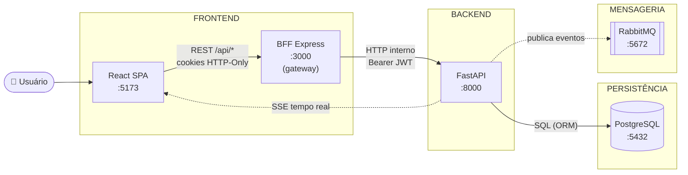
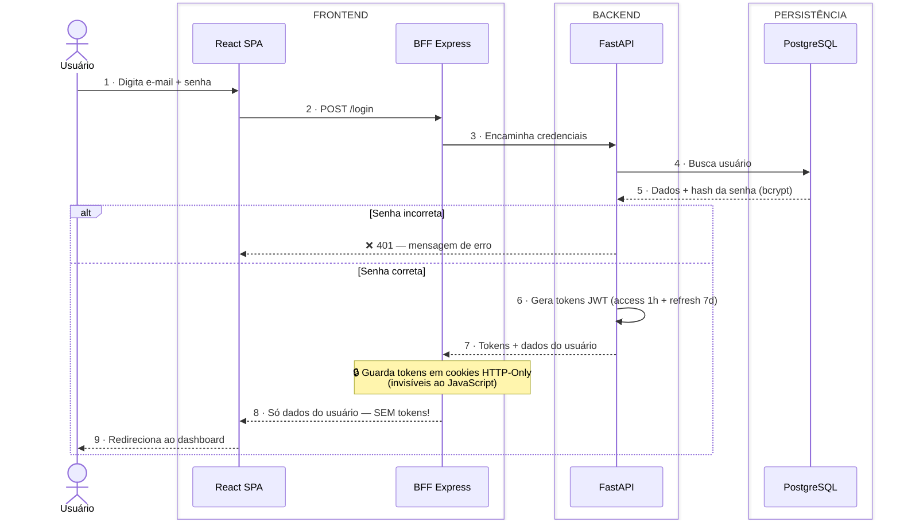
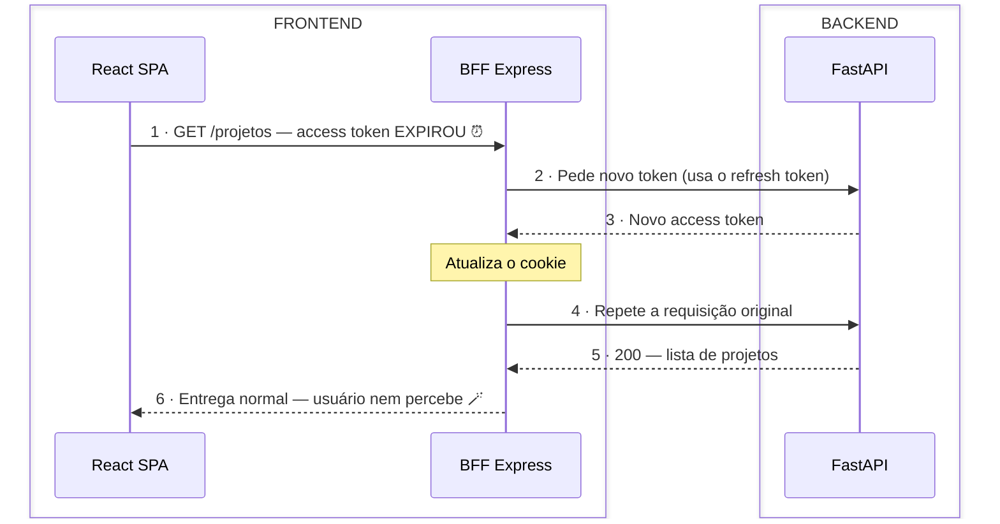
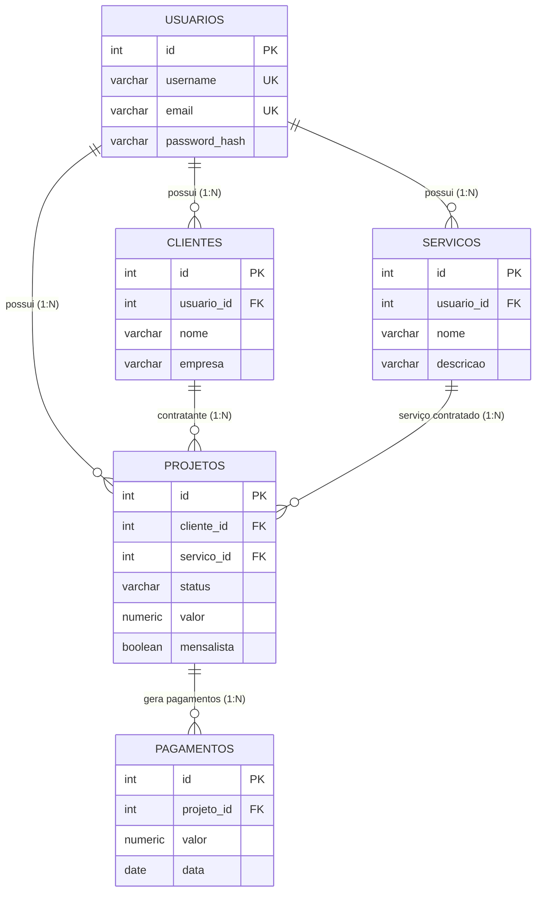

# 🎯 WorkMy — Pitch com Diagramas Mermaid

> Versão do resumo de pitch com diagramas **Mermaid simples** (tema padrão, sem cores customizadas), agrupados por camada: frontend, backend, persistência e mensageria. DER apenas com os campos essenciais.
> Para exportar como imagem: cole cada bloco em [mermaid.live](https://mermaid.live) → Export PNG.

---

## 1️⃣ Arquitetura — Integração Front → Back → Banco

**Como eles conversam:**

| De → Para | Protocolo | O que trafega |
|---|---|---|
| SPA → BFF | REST (`/api/*`) com `credentials: include` | Requisições do usuário; cookies HTTP-Only vão junto automaticamente |
| BFF → FastAPI | HTTP interno na rede Docker | BFF injeta `Authorization: Bearer JWT` lido do cookie |
| FastAPI → PostgreSQL | SQL assíncrono (SQLAlchemy 2.0 + asyncpg) | Consultas e persistência das 5 tabelas |
| FastAPI → RabbitMQ | AMQP (aio_pika) | Eventos de domínio na exchange `workmy_events` (ex: projeto criado) |
| FastAPI → SPA | SSE (`/events`, via proxy do BFF) | Notificações em tempo real → o front invalida o cache e re-busca |

### Como explicar (30 segundos)

O sistema é dividido em camadas, **cada uma com uma única responsabilidade**:

1. **React SPA** — a tela que o usuário vê.
2. **BFF (Backend For Frontend)** — um "porteiro" entre o front e o back. Guarda o token em cookies seguros; o navegador nunca tem acesso direto a ele.
3. **FastAPI** — onde moram as regras de negócio (validações, cálculos, permissões).
4. **PostgreSQL** — onde os dados ficam guardados.
5. **RabbitMQ** — fila de eventos: quando algo muda (ex: projeto criado), o backend publica um evento, e o front recebe a notificação em tempo real via SSE (setas pontilhadas = assíncrono).

**Frase de impacto:** *"O front nunca fala direto com o banco e nunca vê o token — cada camada só conhece a vizinha. Isso dá segurança e facilidade de manutenção."*

---

## 2️⃣ Diagrama de Sequência — Login

### Como explicar (45 segundos)

1. O usuário digita e-mail e senha; o front envia ao **BFF**.
2. O BFF repassa ao **FastAPI**, que busca o usuário no banco e **compara a senha com o hash** (bcrypt — a senha nunca é guardada em texto).
3. Senha correta → a API gera **2 tokens JWT**: um de acesso (1h) e um de renovação (7 dias).
4. **Ponto-chave:** o BFF guarda os tokens em **cookies HTTP-Only** e devolve ao navegador **apenas os dados do usuário** — o JavaScript nunca toca no token.

**Frase de impacto:** *"Mesmo que um script malicioso rode no navegador (ataque XSS), ele não consegue roubar o token, porque o token nunca chega ao JavaScript."*

---

## 3️⃣ Silent Refresh — Renovação Automática da Sessão

### Como explicar (30 segundos)

1. O token de acesso dura só **1 hora** (por segurança). O de renovação dura **7 dias**.
2. Quando o de 1h expira, o **BFF resolve sozinho**: usa o refresh token para pedir um novo access token à API, atualiza o cookie e **repete a requisição original** — tudo na mesma chamada.
3. Para o usuário, nada aconteceu: a tela carrega normalmente, **sem deslogar e sem pedir senha de novo**.
4. Só quando os 7 dias do refresh expiram é que o sistema pede login novamente.

**Frase de impacto:** *"Token curto dá segurança; refresh automático dá conforto. O usuário fica 7 dias logado, mas um token roubado só vale por 1 hora."*

---

## 4️⃣ DER — Modelo do Banco de Dados

### Como explicar (45 segundos)

São **5 tabelas** que contam a história do negócio:

1. **USUARIOS** — o freelancer dono da conta. Tudo no sistema pertence a um usuário (*multitenant*: um usuário nunca vê dados do outro).
2. **CLIENTES** — quem contrata o freelancer.
3. **SERVICOS** — o que o freelancer oferece (ex: "criação de site").
4. **PROJETOS** — a tabela central: junta **um cliente + um serviço**, com status, valor e se é mensal ou avulso.
5. **PAGAMENTOS** — cada cobrança gerada por um projeto.

**Frase de impacto:** *"Um projeto é a união de um cliente com um serviço — e cada projeto gera seus pagamentos. Todo registro tem soft delete: nada é apagado de verdade, o histórico é preservado."*

---

## Referências

| Diagrama | Versão original |
|---|---|
| Login + refresh + logout | [01_DIAGRAMA_SEQUENCIA_LOGIN.md](./01_DIAGRAMA_SEQUENCIA_LOGIN.md) |
| DER + ORM | [04_DER_ORM_SQL.md](./04_DER_ORM_SQL.md) |
| Resumo p/ slides (simplificado) | [00_RESUMO_PITCH.md](./00_RESUMO_PITCH.md) |
| Deck pronto | [WorkMy_Pitch.pptx](./WorkMy_Pitch.pptx) |
