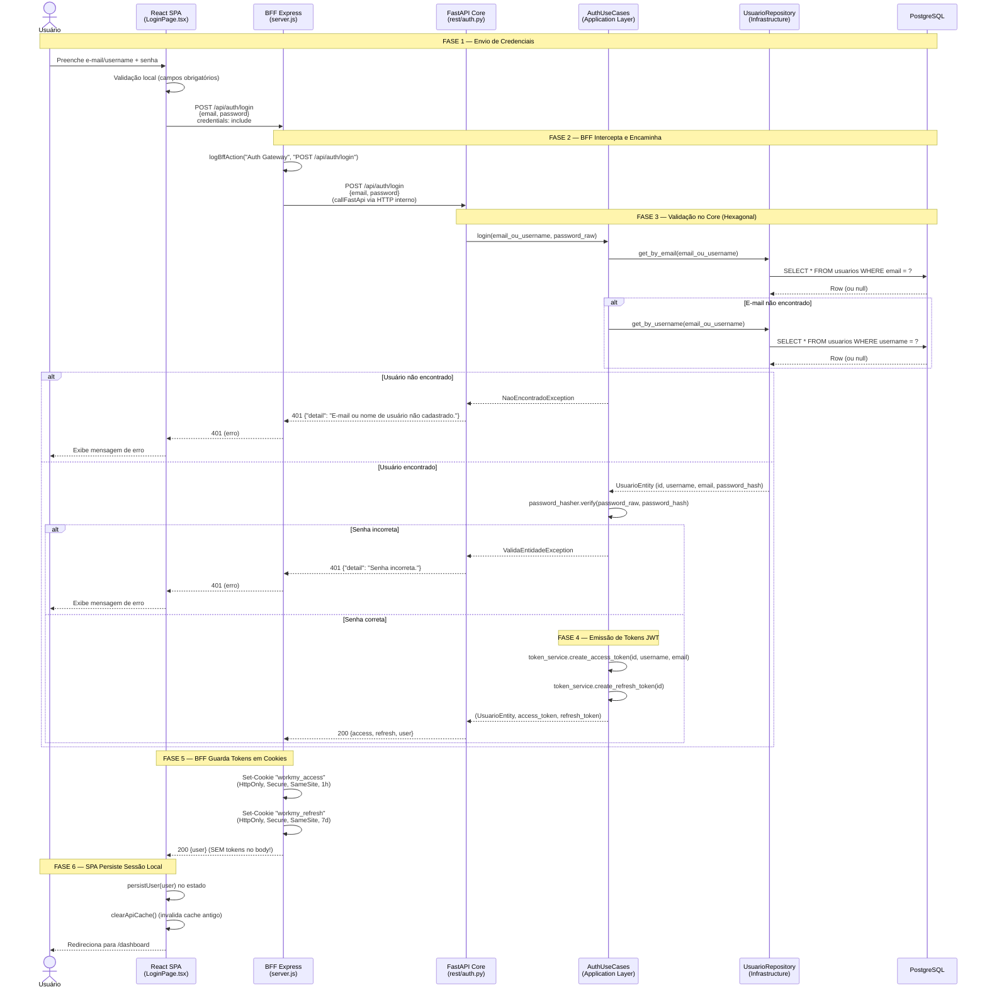
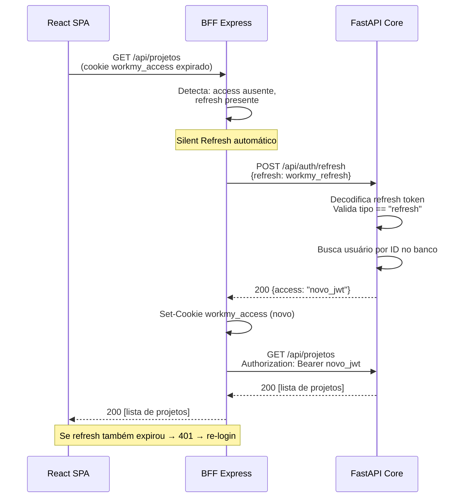
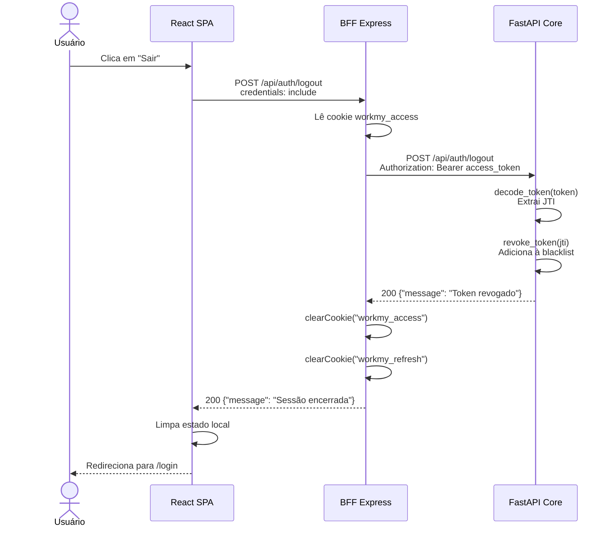

# 🔐 Diagrama de Sequência — Autenticação (Login)

> Este documento apresenta o **Diagrama de Sequência UML** do fluxo de autenticação do sistema WorkMy, descrevendo passo a passo a interação entre os componentes desde a ação do usuário até a criação da sessão segura.

---

## 1. Visão Geral do Fluxo

O sistema WorkMy adota uma estratégia de autenticação baseada em **cookies HTTP-Only** gerenciados por um BFF (Backend For Frontend). O token JWT **nunca é exposto ao JavaScript do navegador**, mitigando ataques XSS. O fluxo completo envolve 4 participantes:

| Participante | Responsabilidade |
|---|---|
| **Usuário** | Informa credenciais (e-mail ou username + senha) |
| **React SPA** | Envia requisição ao BFF com `credentials: include` |
| **BFF (Express)** | Intercepta login, guarda tokens em cookies HTTP-Only |
| **FastAPI Core** | Valida credenciais, gera JWT (access + refresh) |
| **PostgreSQL** | Armazena hash da senha e dados do usuário |

---

## 2. Diagrama de Sequência — Login

---

## 3. Diagrama de Sequência — Silent Refresh

Quando o **access token** (1 hora) expira mas o **refresh token** (7 dias) ainda é válido, o BFF executa a renovação **transparentemente**, sem que o usuário perceba:

---

## 4. Diagrama de Sequência — Logout

---

## 5. Rastreabilidade — De onde vem cada participante no código

| Participante no Diagrama | Arquivo no Código-Fonte |
|---|---|
| React SPA (LoginPage) | `frontend/src/pages/LoginPage.tsx` |
| BFF Express (server.js) | `frontend/bff/server.js` — linhas 138-160 (login), 189-209 (logout), 216-271 (middleware) |
| FastAPI Router (auth) | `backend-fastapi/src/presentation/rest/auth.py` |
| AuthUseCases | `backend-fastapi/src/application/usecases/auth_usecases.py` |
| UsuarioRepository | `backend-fastapi/src/infrastructure/persistence/repositories/postgres_usuario_repo.py` |
| PostgreSQL | Tabela `usuarios` — definida em `backend-fastapi/src/infrastructure/persistence/models.py` (linhas 7-18) |

---

## 6. Decisões de Segurança

| Decisão | Justificativa |
|---|---|
| **JWT em cookies HTTP-Only** | O token nunca é acessível via `document.cookie` no JavaScript. Mitiga XSS. |
| **SameSite = strict (prod)** | Impede envio do cookie em requisições cross-site (CSRF). |
| **Secure = true (prod)** | Cookie só é transmitido por HTTPS. |
| **Blacklist de JTI no logout** | Permite invalidação imediata de tokens, mesmo antes de expirar. |
| **Bcrypt para hash de senha** | Algoritmo com salt automático e fator de trabalho configurável. |
| **Access 1h + Refresh 7d** | Equilíbrio entre UX (sessão longa) e segurança (janela de exposição curta). |
