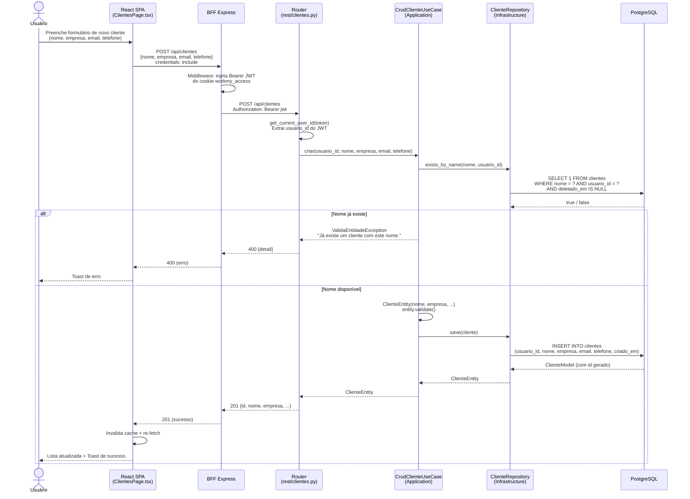
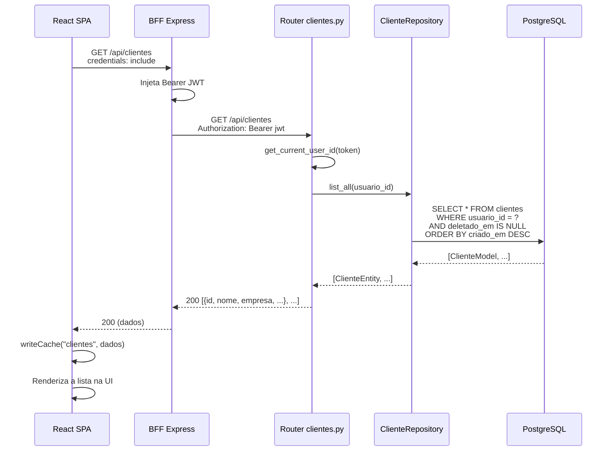
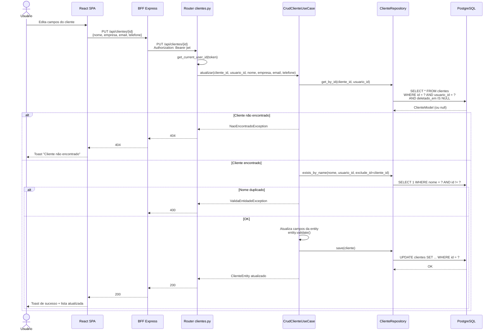
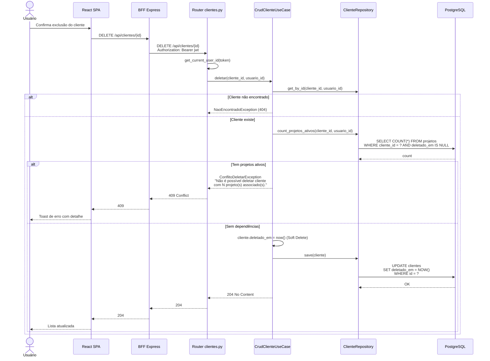
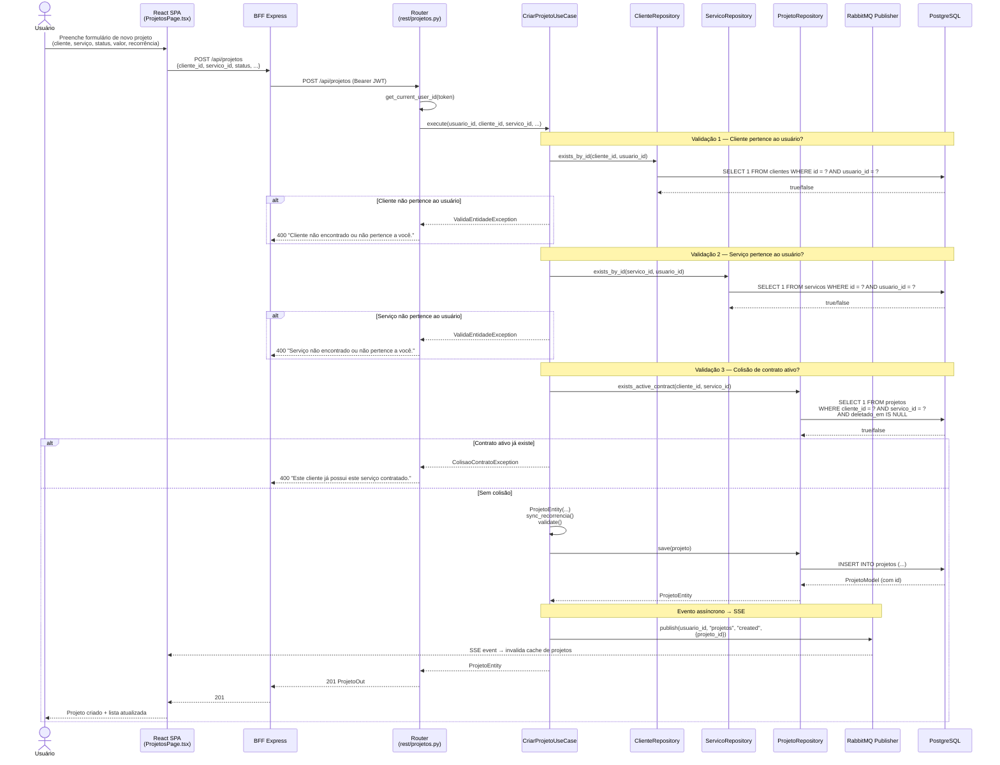

# 📝 Diagramas de Sequência — Operações CRUD

> Este documento apresenta os **Diagramas de Sequência UML** das operações CRUD (Create, Read, Update, Delete) do sistema WorkMy, utilizando como exemplos representativos as entidades **Cliente** e **Projeto**.

---

## 1. Visão Geral

Todas as operações CRUD seguem o mesmo padrão arquitetural multicamada:

```
SPA → BFF (injeta Bearer) → FastAPI Router → Use Case → Repository → PostgreSQL
```

O **BFF injeta o JWT** (cookies HTTP-Only) no header `Authorization: Bearer`. O **Router** valida o token e extrai o `usuario_id`. O **Use Case** aplica regras de negócio. O **Repository** persiste no banco.

---

## 2. CRUD de Cliente — Criar (POST)



---

## 3. CRUD de Cliente — Listar (GET)



---

## 4. CRUD de Cliente — Atualizar (PUT)



---

## 5. CRUD de Cliente — Deletar (DELETE) — Soft Delete



---

## 6. Criar Projeto — Com Regras de Negócio + Evento Assíncrono

Este fluxo é mais complexo pois envolve **validação de múltiplas entidades** e **publicação de evento** no RabbitMQ para invalidação de cache via SSE:



---

## 7. Rastreabilidade — Código-Fonte

| Diagrama | Arquivo Principal |
|---|---|
| CRUD Cliente (Criar/Atualizar/Deletar) | `backend-fastapi/src/application/usecases/crud_cliente.py` |
| CRUD Cliente (Router) | `backend-fastapi/src/presentation/rest/clientes.py` |
| Criar Projeto (Use Case) | `backend-fastapi/src/application/usecases/criar_projeto.py` |
| Criar Projeto (Router) | `backend-fastapi/src/presentation/rest/projetos.py` |
| RabbitMQ Publisher | `backend-fastapi/src/infrastructure/messaging/rabbitmq_publisher.py` |
| Frontend ClientesPage | `frontend/src/pages/ClientesPage.tsx` |
| Frontend ProjetosPage | `frontend/src/pages/ProjetosPage.tsx` |
| BFF (injeção JWT) | `frontend/bff/server.js` — middleware (linhas 216-271) |

---

## 8. Padrões Observados nos CRUDs

| Padrão | Descrição |
|---|---|
| **Soft Delete** | Todas as exclusões setam `deletado_em = NOW()` — o registro não é removido fisicamente. |
| **Isolamento por usuario_id** | Toda query filtra `WHERE usuario_id = ?` — um usuário nunca vê dados de outro. |
| **Validação no Domain** | `entity.validate()` é chamado antes de salvar, garantindo regras de negócio no núcleo. |
| **Evento assíncrono (RabbitMQ)** | Mutações disparam eventos para invalidação de cache em tempo real via SSE. |
| **Injeção de Dependência** | `dependencies.py` monta a composição Use Case + Repositories via `Depends()` do FastAPI. |
