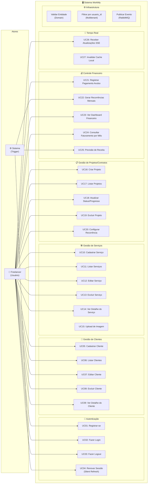

# 🎯 Diagrama de Casos de Uso — Refinado

> Este documento apresenta o **Diagrama de Casos de Uso UML refinado** do sistema WorkMy, identificando todos os atores, casos de uso e seus relacionamentos (`include`, `extend`).

---

## 1. Atores do Sistema

| Ator | Descrição |
|------|-----------|
| **Freelancer (Usuário)** | Ator principal. Utiliza o sistema para gerenciar clientes, serviços, projetos/contratos e controle financeiro. |
| **Sistema (Timer/Trigger)** | Ator de sistema responsável por acionar a geração de cobranças recorrentes e heartbeat SSE. |
| **PostgreSQL** | Banco de dados relacional que persiste todas as entidades com transações ACID. |
| **RabbitMQ** | Broker de mensageria que distribui eventos assíncronos para invalidação de cache em tempo real. |

---

## 2. Diagrama de Casos de Uso — Geral

---

## 3. Diagrama de Casos de Uso com Relacionamentos (include/extend)

```mermaid
flowchart TB
    subgraph UC_AUTH["🔐 Casos de Uso: Autenticação"]
        UC02["UC02: Fazer Login"]
        UC01["UC01: Registrar-se"]
        UC03["UC03: Fazer Logout"]
        UC04["UC04: Silent Refresh"]
        VAL_CRED["Validar Credenciais"]
        EMIT_JWT["Emitir Tokens JWT"]
        SET_COOKIE["Gravar Cookies HTTP-Only"]
        REV_TOKEN["Revogar Token (blacklist JTI)"]
        CLEAR_COOKIE["Limpar Cookies"]

        UC02 -->|"<<include>>"| VAL_CRED
        UC02 -->|"<<include>>"| EMIT_JWT
        UC02 -->|"<<include>>"| SET_COOKIE
        UC01 -->|"<<include>>"| EMIT_JWT
        UC01 -->|"<<include>>"| SET_COOKIE
        UC03 -->|"<<include>>"| REV_TOKEN
        UC03 -->|"<<include>>"| CLEAR_COOKIE
        UC04 -->|"<<include>>"| EMIT_JWT
    end

    subgraph UC_CRUD["📝 Casos de Uso: CRUD Padrão"]
        CRIAR["Criar Entidade"]
        LISTAR["Listar Entidades"]
        EDITAR["Editar Entidade"]
        EXCLUIR["Excluir Entidade"]
        VALIDAR["Validar Entidade (Domain)"]
        ISOLAR["Filtrar por usuario_id"]
        SOFT_DEL["Soft Delete (deletado_em)"]
        PUB_EV["Publicar Evento (RabbitMQ)"]

        CRIAR -->|"<<include>>"| VALIDAR
        CRIAR -->|"<<include>>"| ISOLAR
        CRIAR -->|"<<extend>>"| PUB_EV
        EDITAR -->|"<<include>>"| VALIDAR
        EDITAR -->|"<<include>>"| ISOLAR
        LISTAR -->|"<<include>>"| ISOLAR
        EXCLUIR -->|"<<include>>"| ISOLAR
        EXCLUIR -->|"<<include>>"| SOFT_DEL
    end

    subgraph UC_PROJ["📋 Criar Projeto (Refinado)"]
        UC16["UC16: Criar Projeto"]
        CHECK_CLI["Verificar Cliente Existe"]
        CHECK_SRV["Verificar Serviço Existe"]
        CHECK_COL["Verificar Colisão de Contrato"]
        SYNC_REC["Sincronizar Recorrência"]

        UC16 -->|"<<include>>"| CHECK_CLI
        UC16 -->|"<<include>>"| CHECK_SRV
        UC16 -->|"<<include>>"| CHECK_COL
        UC16 -->|"<<extend>>"| SYNC_REC
        UC16 -->|"<<include>>"| VALIDAR
        UC16 -->|"<<include>>"| PUB_EV
    end

    subgraph UC_FIN["💰 Faturamento Recorrente"]
        UC22["UC22: Gerar Recorrências"]
        LIST_REC["Listar Projetos Recorrentes Ativos"]
        CHECK_VENC["Verificar dia_vencimento >= hoje"]
        CHECK_IDEMP["Verificar idempotência<br/>(referencia_mes)"]
        CRIAR_PAG["Criar PagamentoEntity MENSAL"]

        UC22 -->|"<<include>>"| LIST_REC
        UC22 -->|"<<include>>"| CHECK_VENC
        UC22 -->|"<<include>>"| CHECK_IDEMP
        UC22 -->|"<<extend>>"| CRIAR_PAG
        CRIAR_PAG -->|"<<include>>"| PUB_EV
    end
```

---

## 4. Descrição Detalhada dos Casos de Uso Principais

### UC02 — Fazer Login

| Campo | Descrição |
|-------|-----------|
| **Ator** | Freelancer |
| **Pré-condição** | Usuário já registrado no sistema |
| **Fluxo Principal** | 1. Usuário informa e-mail/username + senha → 2. BFF encaminha ao FastAPI → 3. Use Case busca usuário no banco → 4. Verifica hash bcrypt → 5. Emite access + refresh JWT → 6. BFF grava cookies HTTP-Only → 7. SPA recebe dados do usuário (sem tokens) → 8. Redireciona ao /dashboard |
| **Fluxo Alternativo** | FA1: Usuário não encontrado → 401; FA2: Senha incorreta → 401; FA3: Access expirado → Silent Refresh (UC04) |
| **Pós-condição** | Sessão ativa com cookies seguros. Usuário autenticado. |
| **Inclui** | Validar Credenciais, Emitir JWT, Gravar Cookies |

---

### UC16 — Criar Projeto

| Campo | Descrição |
|-------|-----------|
| **Ator** | Freelancer |
| **Pré-condição** | Usuário autenticado, ao menos 1 cliente e 1 serviço cadastrados |
| **Fluxo Principal** | 1. Seleciona cliente + serviço + parâmetros → 2. Use Case verifica propriedade do cliente → 3. Verifica propriedade do serviço → 4. Verifica colisão de contrato ativo → 5. Instancia ProjetoEntity → 6. sync_recorrencia() → 7. validate() → 8. save() → 9. Publica evento "projetos.created" no RabbitMQ |
| **Fluxo Alternativo** | FA1: Cliente não pertence → 400; FA2: Serviço não pertence → 400; FA3: Contrato já existe (ativo) → 400 ColisaoContratoException |
| **Pós-condição** | Projeto criado. Cache do SPA invalidado via SSE. |
| **Inclui** | Verificar Cliente, Verificar Serviço, Verificar Colisão, Validar Entidade, Publicar Evento |

---

### UC22 — Gerar Recorrências Mensais

| Campo | Descrição |
|-------|-----------|
| **Ator** | Sistema (trigger sob demanda) |
| **Pré-condição** | Projetos com `tipo_recorrencia = MENSAL` e `recorrencia_ativa = true` |
| **Fluxo Principal** | 1. Lista projetos recorrentes ativos → 2. Para cada projeto: verifica `dia_vencimento >= hoje.day` → 3. Verifica se `recorrencia_inicio` já passou → 4. Verifica idempotência (`referencia_mes` já faturado?) → 5. Cria PagamentoEntity MENSAL → 6. Publica evento |
| **Regra de Idempotência** | `UniqueConstraint(projeto_id, referencia_mes)` impede cobrança duplicada no mês |
| **Pós-condição** | No máximo 1 pagamento por projeto por mês. Eventos publicados para SSE. |

---

### UC08 — Excluir Cliente (Soft Delete)

| Campo | Descrição |
|-------|-----------|
| **Ator** | Freelancer |
| **Pré-condição** | Cliente cadastrado e sem projetos ativos associados |
| **Fluxo Principal** | 1. Use Case busca cliente → 2. Conta projetos ativos → 3. Se zero: `deletado_em = NOW()` → 4. Save |
| **Fluxo Alternativo** | FA1: Cliente com projetos ativos → 409 ConflitoDeletarException |
| **Pós-condição** | Registro marcado como deletado. Pode ser recontratado futuramente. |

---

## 5. Mapa UC → Código-Fonte

| Caso de Uso | Arquivo |
|---|---|
| UC01 Registrar | `auth_usecases.py → registrar()` |
| UC02 Login | `auth_usecases.py → login()` |
| UC03 Logout | `rest/auth.py → logout()` + BFF `server.js` |
| UC04 Silent Refresh | `auth_usecases.py → refresh()` + BFF middleware |
| UC05-UC09 Clientes | `crud_cliente.py` + `rest/clientes.py` |
| UC10-UC15 Serviços | `crud_servico.py` + `rest/servicos.py` |
| UC16 Criar Projeto | `criar_projeto.py` |
| UC18 Atualizar Projeto | `atualizar_projeto.py` |
| UC19 Excluir Projeto | `deletar_projeto.py` |
| UC21 Pagamento Avulso | `crud_pagamento.py` |
| UC22 Recorrências | `faturar_recorrencias.py` |
| UC23/24 Dashboard | `rest/dashboard.py` + `postgres_dashboard_query.py` |
| UC26 SSE | `rest/events.py` |
