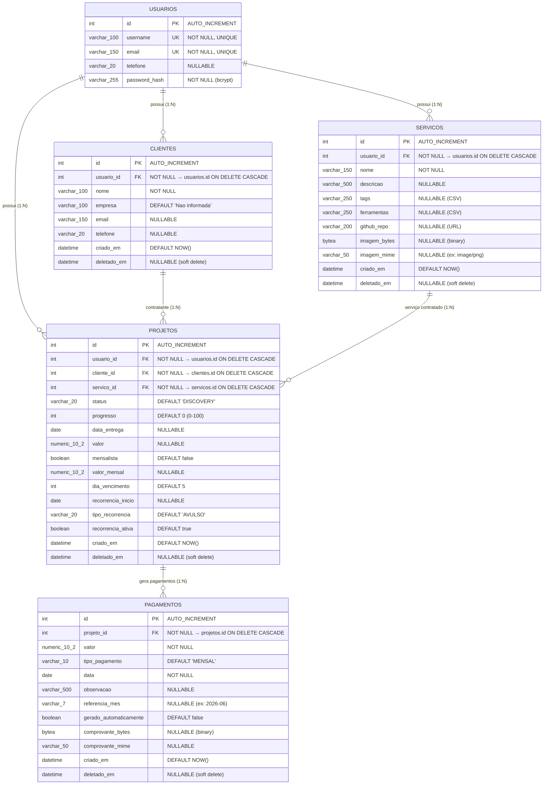
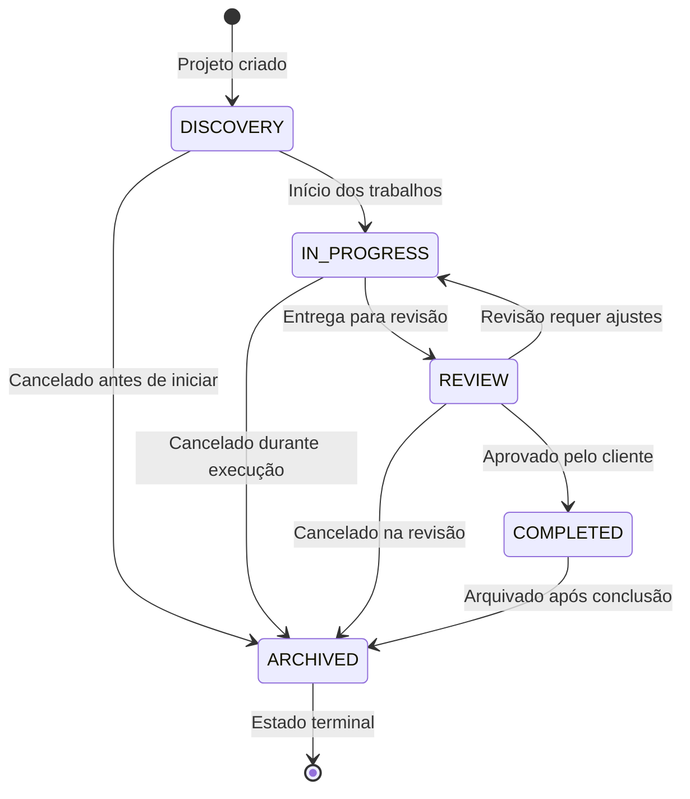

# 🗄️ DER + ORM (SQL)

> Este documento apresenta o **Diagrama Entidade-Relacionamento (DER)** e o **mapeamento ORM** do sistema WorkMy, com explicação de cada tabela, seus relacionamentos e as decisões de modelagem.

---

## 1. Diagrama Entidade-Relacionamento (DER)



---

## 2. Explicação dos Relacionamentos

| Relacionamento | Cardinalidade | Descrição |
|---|---|---|
| USUARIOS → CLIENTES | 1:N | Um usuário (freelancer) cadastra vários clientes. Isolamento multitenant. |
| USUARIOS → SERVICOS | 1:N | Um usuário define vários serviços que oferece. |
| USUARIOS → PROJETOS | 1:N | Um usuário possui vários projetos (para auditoria e filtro direto). |
| CLIENTES → PROJETOS | 1:N | Um cliente pode ter vários projetos/contratos contratados. |
| SERVICOS → PROJETOS | 1:N | Um serviço pode estar em vários projetos (com clientes diferentes). |
| PROJETOS → PAGAMENTOS | 1:N | Um projeto gera vários pagamentos (mensais ou avulsos). |

---

## 3. Constraints e Regras de Integridade

| Regra | Implementação | Localização |
|---|---|---|
| **Unicidade de e-mail/username** | `UNIQUE` nas colunas `email` e `username` de `usuarios` | `models.py` L11-12 |
| **Isolamento multitenant** | Todo `SELECT/INSERT/UPDATE` filtra por `usuario_id` | Repositories |
| **Soft Delete universal** | Coluna `deletado_em` (NULLABLE) em todas as entidades de negócio | `models.py` |
| **Idempotência de faturamento** | `UniqueConstraint("projeto_id", "referencia_mes")` em `pagamentos` | `models.py` L106-108 |
| **Cascade on delete** | `ForeignKey(..., ondelete="CASCADE")` em todas as FKs | `models.py` |
| **Colisão de contrato (lógica)** | `exists_active_contract()` verifica unicidade de (cliente, serviço) onde `deletado_em IS NULL` | `criar_projeto.py` |

---

## 4. Máquina de Estados do Projeto

O campo `status` de `PROJETOS` segue transições definidas no domínio:



---

## 5. Mapeamento ORM — SQLAlchemy

A tabela abaixo mostra como cada tabela do banco é mapeada para classes ORM no SQLAlchemy 2.0:

| Tabela SQL | Classe ORM | Arquivo |
|---|---|---|
| `usuarios` | `UsuarioModel` | `models.py` L7-18 |
| `clientes` | `ClienteModel` | `models.py` L21-34 |
| `servicos` | `ServicoModel` | `models.py` L37-53 |
| `projetos` | `ProjetoModel` | `models.py` L56-85 |
| `pagamentos` | `PagamentoModel` | `models.py` L88-108 |

### Exemplo: UsuarioModel (ORM)

```python
class UsuarioModel(Base):
    __tablename__ = "usuarios"

    id: Mapped[int] = mapped_column(Integer, primary_key=True, autoincrement=True)
    username: Mapped[str] = mapped_column(String(100), unique=True, nullable=False)
    email: Mapped[str] = mapped_column(String(150), unique=True, nullable=False)
    telefone: Mapped[str | None] = mapped_column(String(20), nullable=True)
    password_hash: Mapped[str] = mapped_column(String(255), nullable=False)

    # Relacionamentos ORM
    clientes: Mapped[list["ClienteModel"]] = relationship("ClienteModel", back_populates="usuario")
    servicos: Mapped[list["ServicoModel"]] = relationship("ServicoModel", back_populates="usuario")
    projetos: Mapped[list["ProjetoModel"]] = relationship("ProjetoModel", back_populates="usuario")
```

### Exemplo: PagamentoModel (ORM com UniqueConstraint)

```python
class PagamentoModel(Base):
    __tablename__ = "pagamentos"

    id: Mapped[int] = mapped_column(Integer, primary_key=True, autoincrement=True)
    projeto_id: Mapped[int] = mapped_column(Integer, ForeignKey("projetos.id", ondelete="CASCADE"), nullable=False)
    valor: Mapped[Decimal] = mapped_column(Numeric(10, 2), nullable=False)
    tipo_pagamento: Mapped[str] = mapped_column(String(10), default="MENSAL", nullable=False)
    referencia_mes: Mapped[str | None] = mapped_column(String(7), nullable=True)
    gerado_automaticamente: Mapped[bool] = mapped_column(Boolean, default=False, nullable=False)
    # ...

    __table_args__ = (
        UniqueConstraint("projeto_id", "referencia_mes", name="uniq_pagamento_projeto_referencia_mes"),
    )
```

---

## 6. Domain Entities vs ORM Models

O projeto separa **Domain Entities** (regras de negócio puras) dos **ORM Models** (persistência):

| Conceito | Responsabilidade | Localização |
|---|---|---|
| **Domain Entity** | Validação, regras de negócio, transições de estado | `domain/entities/*.py` |
| **ORM Model** | Mapeamento para tabela SQL, relacionamentos físicos | `infrastructure/persistence/models.py` |
| **Repository** | Converte entre Entity ↔ Model | `infrastructure/persistence/repositories/*.py` |

O Use Case **nunca** importa o ORM Model diretamente. Ele trabalha apenas com Entities e Ports (interfaces).

---

## 7. Decisões de Modelagem

| Decisão | Justificativa |
|---|---|
| **Soft Delete em tudo** | Preserva histórico. Permite recontratação de clientes/serviços excluídos. |
| **`usuario_id` em projetos (redundante)** | Permite filtros O(1) sem JOINs para listagem de projetos. Trade-off: desnormalização controlada. |
| **`tags` e `ferramentas` como CSV** | Simplicidade. Para filtros avançados, migraria para tabela N:N ou `ARRAY[]` do PostgreSQL. |
| **Imagem/comprovante como `bytea`** | Armazena o binário no banco. Para escala, migraria para Object Storage (S3). |
| **`referencia_mes` como String "YYYY-MM"** | Facilita a constraint de unicidade e consultas por período. |
