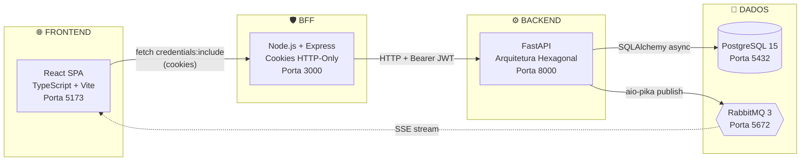
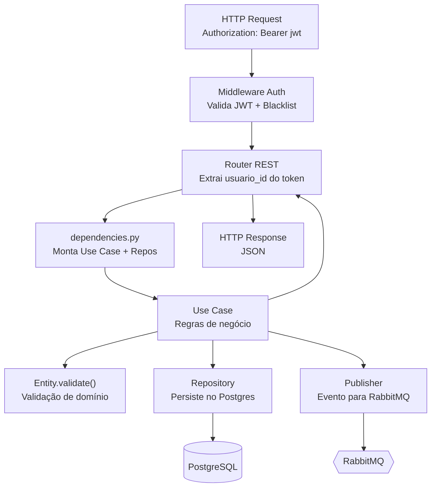
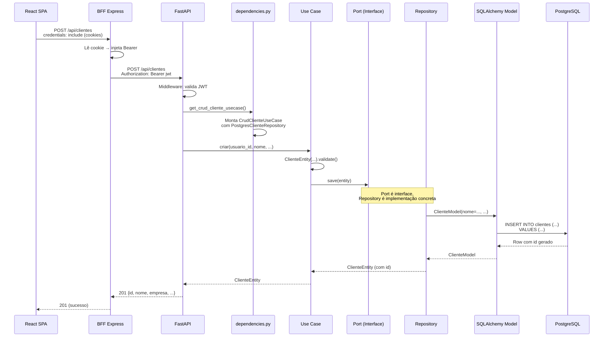

# 💻 Código do Sistema — Frontend, Backend e Integração com BD

> Este documento explica a organização do código-fonte do WorkMy, detalhando as responsabilidades de cada camada (Front, Back, BD) e **como elas se integram** entre si.

---

## 1. Visão Geral da Arquitetura de Código

O sistema é composto por **4 processos independentes** que se comunicam por rede:



---

## 2. Frontend (React SPA)

### 2.1 Estrutura de Diretórios

```
frontend/
├── src/
│   ├── App.tsx                    # Roteamento principal (React Router 7)
│   ├── main.tsx                   # Entry point do Vite
│   ├── types.ts                   # Tipos TypeScript globais
│   ├── config.ts                  # Configuração de URLs e ambiente
│   ├── index.css                  # Estilos globais (CSS)
│   ├── pages/                     # Páginas da aplicação
│   │   ├── LoginPage.tsx          # Tela de login
│   │   ├── RegisterPage.tsx       # Tela de cadastro
│   │   ├── DashboardPage.tsx      # Painel financeiro com gráficos
│   │   ├── ClientesPage.tsx       # CRUD de clientes
│   │   ├── ClienteDetailPage.tsx  # Detalhe do cliente + projetos + pagamentos
│   │   ├── ServicosPage.tsx       # CRUD de serviços
│   │   ├── ServicoDetailPage.tsx  # Detalhe do serviço + projetos
│   │   └── ProjetosPage.tsx       # CRUD de projetos/contratos
│   ├── components/                # Componentes reutilizáveis
│   │   ├── AppLayout.tsx          # Layout com sidebar
│   │   └── ProtectedRoute.tsx     # Guarda de rotas (verifica sessão)
│   ├── hooks/                     # Custom hooks
│   ├── shared/lib/                # Utilitários (cache, HTTP)
│   └── state/                     # Gerenciamento de estado
├── bff/                           # Backend For Frontend
│   ├── server.js                  # Express proxy gateway
│   ├── Dockerfile                 # Container para produção
│   └── package.json
├── index.html                     # HTML base do Vite
├── vite.config.ts                 # Configuração do Vite
└── package.json
```

### 2.2 Roteamento (App.tsx)

```tsx
// Rotas públicas (sem autenticação)
<Route path="/login" element={<LoginPage />} />
<Route path="/register" element={<RegisterPage />} />

// Rotas protegidas (requer sessão ativa)
<Route path="/" element={<ProtectedRoute><AppLayout /></ProtectedRoute>}>
    <Route index element={<Navigate to="/dashboard" replace />} />
    <Route path="dashboard" element={<DashboardPage />} />
    <Route path="projetos" element={<ProjetosPage />} />
    <Route path="clientes" element={<ClientesPage />} />
    <Route path="clientes/:id" element={<ClienteDetailPage />} />
    <Route path="servicos" element={<ServicosPage />} />
    <Route path="servicos/:id" element={<ServicoDetailPage />} />
</Route>
```

### 2.3 Como o Frontend se comunica

O SPA **nunca** fala diretamente com o FastAPI. Toda comunicação passa pelo BFF:

```typescript
// Toda requisição usa credentials: include para enviar os cookies
const response = await fetch('/api/clientes', {
    method: 'POST',
    credentials: 'include',     // envia cookies workmy_access / workmy_refresh
    headers: { 'Content-Type': 'application/json' },
    body: JSON.stringify({ nome, empresa, email, telefone })
});
```

### 2.4 Tipos TypeScript (contratos de dados)

```typescript
type User = { id: number; username: string; email: string; telefone?: string }
type Cliente = { id: number; nome: string; empresa: string; email?: string; telefone?: string; total_acumulado: string; criado_em: string }
type Servico = { id: number; nome: string; descricao?: string; tags?: string; ferramentas?: string; github_repo?: string; imagem_base64?: string }
type Projeto = { id: number; cliente_id: number; cliente_nome: string; servico_id: number; servico_nome: string; status: 'DISCOVERY' | 'IN_PROGRESS' | 'REVIEW' | 'COMPLETED'; progresso: number; tipo_recorrencia: 'MENSAL' | 'AVULSO'; valor: string | null; total_acumulado: string }
type Pagamento = { id: number; projeto_id: number; valor: string; tipo_pagamento: 'MENSAL' | 'AVULSO'; data: string; observacao?: string }
```

---

## 3. BFF — Backend For Frontend (Node.js)

### 3.1 Responsabilidades

O BFF é um **gateway de segurança** entre o SPA e o FastAPI. Ele:

| Responsabilidade | Implementação |
|---|---|
| Guarda JWT em cookies HTTP-Only | `setSessionCookies()` — linha 124 de `server.js` |
| Injeta Bearer no header antes de encaminhar | Middleware — linhas 216-271 |
| Silent Refresh automático | Middleware — linhas 242-265 |
| Proxy de rotas `/api/*` | `app.all('/api/*')` — linhas 289-322 |
| Proxy de SSE stream | `createProxyMiddleware` — linhas 277-283 |
| Intercepta login/register/logout | Handlers dedicados — linhas 138-209 |

### 3.2 Fluxo de uma requisição pelo BFF

```
SPA → POST /api/clientes
      ↓
BFF: Lê cookie workmy_access
      ↓
BFF: req.headers['authorization'] = 'Bearer <jwt>'
      ↓
BFF: callFastApi('/api/clientes', 'POST', body, headers)
      ↓
FastAPI: valida JWT, executa use case
      ↓
BFF: retorna resposta ao SPA
```

---

## 4. Backend (FastAPI — Arquitetura Hexagonal)

### 4.1 Estrutura de Camadas

```
backend-fastapi/src/
├── presentation/                  # Adaptadores de ENTRADA
│   ├── main.py                    # App FastAPI (startup, CORS, routers)
│   ├── dependencies.py            # Injeção de Dependências (composição)
│   ├── middleware/auth.py         # Validação JWT + Blacklist
│   ├── dto/schemas.py            # Pydantic schemas (entrada/saída)
│   └── rest/                     # Routers REST
│       ├── auth.py               # /api/auth/* (login, register, refresh, logout)
│       ├── clientes.py           # /api/clientes/* (CRUD)
│       ├── servicos.py           # /api/servicos/* (CRUD + imagem)
│       ├── projetos.py           # /api/projetos/* (CRUD + recorrência)
│       ├── pagamentos.py         # /api/pagamentos/* (CRUD)
│       ├── dashboard.py          # /api/dashboard/* (agregações)
│       ├── faturamento.py        # /api/faturamento/* (gerar recorrências)
│       └── events.py             # /api/events/stream (SSE)
│
├── application/                   # REGRAS DE APLICAÇÃO
│   ├── usecases/                 # Casos de Uso
│   │   ├── auth_usecases.py      # Registrar, Login, Refresh
│   │   ├── crud_cliente.py       # Criar, Atualizar, Deletar cliente
│   │   ├── crud_servico.py       # Criar, Atualizar, Deletar serviço
│   │   ├── crud_pagamento.py     # Criar, Atualizar, Deletar pagamento
│   │   ├── criar_projeto.py      # Criar projeto (com validações)
│   │   ├── atualizar_projeto.py  # Atualizar status/progresso
│   │   ├── deletar_projeto.py    # Soft delete de projeto
│   │   └── faturar_recorrencias.py # Geração idempotente de mensalidades
│   ├── ports/outbound/           # Interfaces (contratos)
│   │   ├── i_usuario_repository.py
│   │   ├── i_cliente_repository.py
│   │   ├── i_servico_repository.py
│   │   ├── i_projeto_repository.py
│   │   ├── i_pagamento_repository.py
│   │   ├── i_event_publisher.py
│   │   ├── i_password_hasher.py
│   │   └── i_token_service.py
│   └── dto/views.py              # Read models (views de leitura)
│
├── domain/                        # NÚCLEO PURO (sem dependências externas)
│   ├── entities/                 # Entidades de domínio
│   │   ├── usuario.py            # UsuarioEntity + validate()
│   │   ├── cliente.py            # ClienteEntity + validate()
│   │   ├── servico.py            # ServicoEntity + validate()
│   │   ├── projeto.py            # ProjetoEntity + validate() + sync_recorrencia()
│   │   └── pagamento.py          # PagamentoEntity + validate()
│   └── exceptions/
│       └── business_exceptions.py # Exceções de negócio tipadas
│
└── infrastructure/                # Adaptadores de SAÍDA
    ├── persistence/
    │   ├── session.py            # Engine + async_session_maker
    │   ├── models.py             # ORM Models (SQLAlchemy 2.0)
    │   └── repositories/         # Implementações concretas
    │       ├── postgres_usuario_repo.py
    │       ├── postgres_cliente_repo.py
    │       ├── postgres_servico_repo.py
    │       ├── postgres_projeto_repo.py
    │       ├── postgres_pagamento_repo.py
    │       ├── postgres_dashboard_query.py
    │       └── postgres_cliente_query.py
    ├── security/
    │   ├── jwt_service.py        # Criação e decodificação de JWT
    │   └── adapters.py           # BcryptPasswordHasher + JwtTokenService
    └── messaging/
        └── rabbitmq_publisher.py # Publicação de eventos no RabbitMQ
```

### 4.2 Injeção de Dependências (Composição)

O arquivo `dependencies.py` é o **composition root** — ele monta cada Use Case com suas dependências concretas:

```python
def get_criar_projeto_usecase(session: AsyncSession = Depends(get_db_session)):
    return CriarProjetoUseCase(
        projeto_repo=PostgresProjetoRepository(session),   # Adaptador concreto
        cliente_repo=PostgresClienteRepository(session),   # Adaptador concreto
        servico_repo=PostgresServicoRepository(session),   # Adaptador concreto
        event_publisher=rabbitmq_publisher                 # Adaptador concreto
    )
```

O Use Case declara dependência apenas em **interfaces** (Ports):

```python
class CriarProjetoUseCase:
    def __init__(
        self,
        projeto_repo: IProjetoRepository,    # Interface (Port)
        cliente_repo: IClienteRepository,    # Interface (Port)
        servico_repo: IServicoRepository,    # Interface (Port)
        event_publisher: IEventPublisher     # Interface (Port)
    ):
```

### 4.3 Fluxo de uma requisição no Backend



---

## 5. Integração com Banco de Dados

### 5.1 Conexão Assíncrona

```python
# session.py — Configuração da engine assíncrona
DATABASE_URL = os.getenv("DATABASE_URL", "sqlite+aiosqlite:///./db.sqlite3")

engine = create_async_engine(DATABASE_URL, echo=False)

async_session_maker = async_sessionmaker(
    engine,
    class_=AsyncSession,
    expire_on_commit=False,
    autocommit=False,
    autoflush=False
)

# Dependency do FastAPI — transação por request
async def get_db_session():
    async with async_session_maker() as session:
        try:
            yield session
            await session.commit()      # Commit automático se não houver erro
        except Exception:
            await session.rollback()    # Rollback automático em caso de erro
            raise
        finally:
            await session.close()
```

### 5.2 Exemplo de Repository (Implementação)

```python
# postgres_cliente_repo.py (simplificado)
class PostgresClienteRepository(IClienteRepository):
    def __init__(self, session: AsyncSession):
        self.session = session

    async def save(self, entity: ClienteEntity) -> ClienteEntity:
        if entity.id:
            # UPDATE — merge na sessão
            model = await self.session.get(ClienteModel, entity.id)
            model.nome = entity.nome
            model.empresa = entity.empresa
            # ...
        else:
            # INSERT — adiciona novo
            model = ClienteModel(
                usuario_id=entity.usuario_id,
                nome=entity.nome,
                empresa=entity.empresa,
                # ...
            )
            self.session.add(model)

        await self.session.flush()  # Gera o ID
        return self._to_entity(model)

    async def get_by_id(self, id: int, usuario_id: int) -> ClienteEntity | None:
        stmt = select(ClienteModel).where(
            ClienteModel.id == id,
            ClienteModel.usuario_id == usuario_id,
            ClienteModel.deletado_em.is_(None)   # Ignora soft-deleted
        )
        result = await self.session.execute(stmt)
        model = result.scalar_one_or_none()
        return self._to_entity(model) if model else None
```

### 5.3 Fluxo Completo: React → BFF → FastAPI → PostgreSQL



---

## 6. Integração em Tempo Real (SSE + RabbitMQ)

Quando uma mutação ocorre (criar, editar, excluir), o sistema:

1. **Use Case** publica evento no RabbitMQ (`event_publisher.publish()`)
2. **RabbitMQ** entrega ao consumer no FastAPI
3. **FastAPI** envia SSE (Server-Sent Events) para o SPA
4. **SPA** (`useRealtime` hook) invalida o cache local e re-busca os dados

```
Use Case → rabbitmq_publisher.publish("projetos", "created")
         → RabbitMQ exchange 'workmy_events' (topic)
         → FastAPI /events/stream (SSE)
         → BFF proxy stream
         → SPA EventSource → handleRealtimeEvent → invalidateCache("projetos")
         → SPA re-fetch GET /api/projetos
```

---

## 7. Resumo das Tecnologias por Camada

| Camada | Tecnologia | Arquivo Principal | Responsabilidade |
|---|---|---|---|
| **UI** | React 19, TypeScript, Vite | `App.tsx`, `pages/*.tsx` | Renderização, roteamento, formulários |
| **Cache** | LocalStorage + SSE | `shared/lib/cache.ts`, `hooks/useRealtime.ts` | Cache write-through com invalidação em tempo real |
| **Gateway** | Node.js, Express | `bff/server.js` | Cookies HTTP-Only, silent refresh, proxy |
| **API REST** | FastAPI, Pydantic | `presentation/rest/*.py` | Endpoints, DTOs, middleware JWT |
| **Use Cases** | Python puro | `application/usecases/*.py` | Regras de negócio da aplicação |
| **Domain** | Python puro | `domain/entities/*.py` | Validação, entidades, exceções |
| **Persistência** | SQLAlchemy 2 async, asyncpg | `infrastructure/persistence/*.py` | Queries, ORM Models, transações |
| **Segurança** | python-jose (JWT), bcrypt | `infrastructure/security/*.py` | Criação/validação de tokens, hash de senha |
| **Mensageria** | aio-pika, RabbitMQ | `infrastructure/messaging/*.py` | Publicação de eventos assíncronos |
| **Infra** | Docker Compose | `docker-compose.yml` | Orquestração de Postgres + RabbitMQ |

---

## 8. Endpoints REST da API

| Método | Endpoint | Descrição | Router |
|--------|----------|-----------|--------|
| POST | `/api/auth/register` | Cadastro de novo usuário | `auth.py` |
| POST | `/api/auth/login` | Login (retorna JWT) | `auth.py` |
| POST | `/api/auth/refresh` | Renovação de access token | `auth.py` |
| POST | `/api/auth/logout` | Logout (revoga JTI) | `auth.py` |
| GET | `/api/clientes` | Listar clientes | `clientes.py` |
| POST | `/api/clientes` | Criar cliente | `clientes.py` |
| PUT | `/api/clientes/{id}` | Atualizar cliente | `clientes.py` |
| DELETE | `/api/clientes/{id}` | Deletar cliente (soft) | `clientes.py` |
| GET | `/api/clientes/{id}/detail` | Detalhe do cliente | `clientes.py` |
| GET | `/api/servicos` | Listar serviços | `servicos.py` |
| POST | `/api/servicos` | Criar serviço | `servicos.py` |
| PUT | `/api/servicos/{id}` | Atualizar serviço | `servicos.py` |
| DELETE | `/api/servicos/{id}` | Deletar serviço (soft) | `servicos.py` |
| GET | `/api/projetos` | Listar projetos | `projetos.py` |
| POST | `/api/projetos` | Criar projeto | `projetos.py` |
| PATCH | `/api/projetos/{id}` | Atualizar status/progresso | `projetos.py` |
| DELETE | `/api/projetos/{id}` | Deletar projeto (soft) | `projetos.py` |
| GET | `/api/pagamentos` | Listar pagamentos | `pagamentos.py` |
| POST | `/api/pagamentos` | Criar pagamento avulso | `pagamentos.py` |
| GET | `/api/dashboard/mensal` | Dashboard financeiro | `dashboard.py` |
| POST | `/api/faturamento/recorrencias` | Gerar recorrências | `faturamento.py` |
| GET | `/api/events/stream` | Stream SSE (tempo real) | `events.py` |
