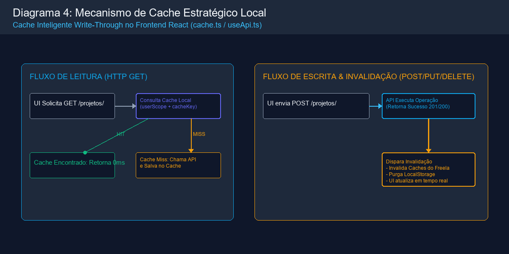
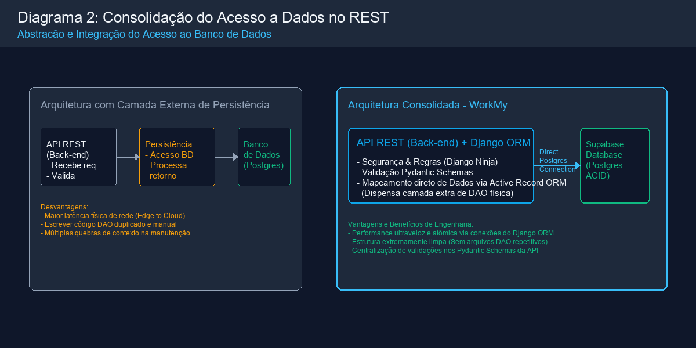
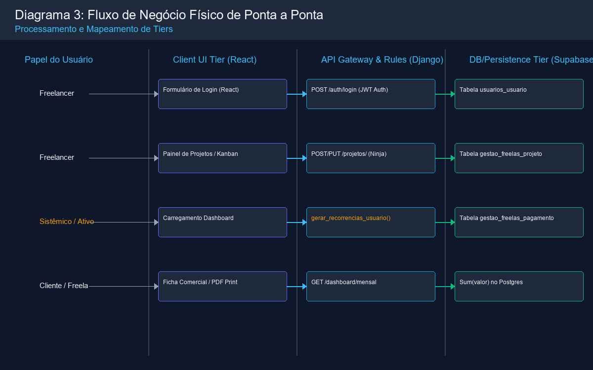
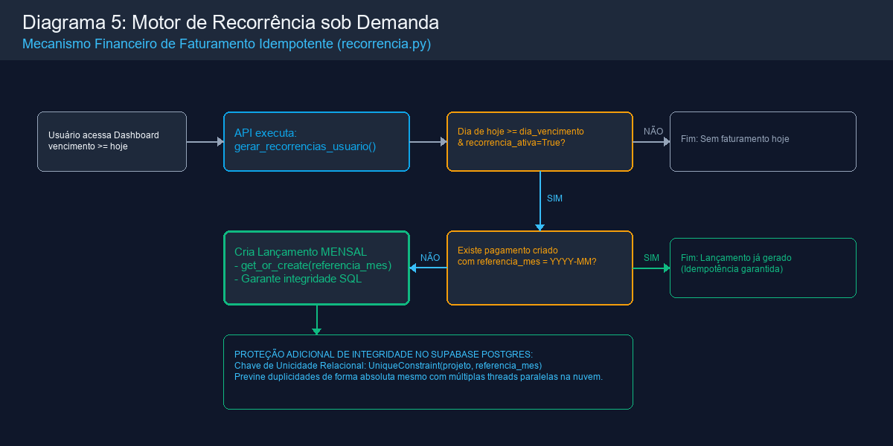

# 🏗️ Documentação de Arquitetura de Software - Plataforma WorkMy

Esta documentação detalha de forma exaustiva as decisões arquiteturais, fluxos de dados, separação de responsabilidades e padrões de design da plataforma **WorkMy**. Este documento foi elaborado sob a perspectiva de um **Engenheiro de Software Staff/Principal**, alinhando as melhores práticas do setor de desenvolvimento web moderno com fundamentos arquiteturais e padrões de projeto de alta performance.

---

## 🧭 1. Visão Geral da Arquitetura (System Overview)

A plataforma WorkMy adota o padrão estrutural de **Sistemas Distribuídos Desacoplados (Decoupled Client-Server Tier)**. Em vez de uma aplicação monolítica integrada, o ecossistema é dividido em três camadas físicas e lógicas fundamentais, promovendo independência de implantação, escalabilidade isolada e segurança de dados:

*Visualização Gráfica da Arquitetura Geral (PNG):*


*   **🔍 Mapeamento Técnico & Localização no Código:**
    *   **Camada de Apresentação:** SPA React construída com Vite e TypeScript no diretório [frontend/src](../frontend/src).
    *   **Camada de Aplicação REST:** Roteamento assíncrono e validação de APIs com FastAPI no diretório [backend-fastapi/src/presentation](../backend-fastapi/src/presentation) e lógica de negócios usando Clean Architecture em [backend-fastapi/src/application](../backend-fastapi/src/application).
    *   **Camada de Persistência:** Repositórios baseados em SQLAlchemy e PostgreSQL no diretório [backend-fastapi/src/infrastructure](../backend-fastapi/src/infrastructure).

### 🔗 Fundamentação Teórica e Correlação Conceitual

A arquitetura do WorkMy foi projetada aplicando diretamente conceitos consolidados de sistemas distribuídos modernos:

1. **A Camada de Controle e o Ciclo de Requisição-Resposta:**
   * *Conceito:* Padrão estrutural clássico de controle web dinâmico baseado em requisição-resposta HTTP sem estado.
   * *Prática no WorkMy:* Traduzimos esses fundamentos clássicos para o paradigma moderno de APIs HTTP REST com FastAPI, mapeando decoradores de rota tipados (`@router.get`, `@router.post`, `@router.put`, `@router.delete`, `@router.patch`) em controladores declarativos e modulares (Routers). O roteamento HTTP é agnóstico das tecnologias subjacentes graças ao uso de Interfaces e Injeção de Dependências.
   
2. **A Arquitetura RESTful e Sem Estado (Stateless):**
   * *Conceito:* Desacoplamento estrito entre o cliente e o servidor através de transferências de representação no formato JSON.
   * *Prática no WorkMy:* O backend expõe uma API 100% Stateless (sem sessões locais no servidor), onde cada requisição HTTP carrega de forma independente a identidade do freelancer em um cabeçalho JWT (`Authorization: Bearer <token>`). O servidor valida o payload e devolve dados representados exclusivamente em JSON tipado.

3. **Arquitetura de Sistemas Multicamadas:**
   * *Conceito:* Divisão funcional de responsabilidades entre apresentação, processamento/regras de negócio e persistência definitiva de dados.
   * *Prática no WorkMy:* O React SPA gerencia a interface no browser do usuário; o Node.js BFF realiza o Proxy lidando com Cookies Secure de autenticação, o FastAPI valida a integridade e aplica regras no servidor utilizando a arquitetura hexagonal; e o PostgreSQL gerencia transações robustas ACID no banco de dados.

---

## ⚡ 2. Camada de Apresentação & Caching Estratégico (Client Tier)

A camada de apresentação é implementada em uma **SPA (Single Page Application)** construída com **React.js + Vite + TypeScript**. Visando maximizar a performance de renderização, eliminar latência de rede em operações repetitivas e otimizar custos de largura de banda com a nuvem, foi projetado um **Mecanismo de Cache de Escrita Direta (Write-Through) e Invalidação Pró-Ativa** no LocalStorage do navegador.

### 🛠️ Estrutura e Mecânica do Cache local

A implementação técnica encontra-se no módulo utilitário [frontend/src/shared/lib/cache.ts](../frontend/src/shared/lib/cache.ts) e é injetada globalmente por meio do hook personalizado de requisições em [frontend/src/hooks/useApi.ts](../frontend/src/hooks/useApi.ts).

1. **Isolamento Multitenant por Usuário (Cache Scoping):**
   Para evitar falhas graves de segurança onde um usuário pudesse ler dados de outro no mesmo computador, as chaves de cache no LocalStorage são protegidas usando um namespace composto pelo ID do usuário autenticado no JWT:
   ```typescript
   export function userCacheScope(userId: number | null | undefined) {
     return `user:${userId ?? 'anon'}`
   }
   ```
2. **Leitura Otimizada (GET Cache Lookup):**
   Antes de despachar uma requisição de leitura (`GET`), o hook `useApi` intercepta a chamada, normaliza o caminho e os parâmetros de consulta em ordem alfabética para construir uma chave única (`buildCacheKey`). Se o registro existir no LocalStorage e o tempo de expiração (TTL) for válido, os dados são entregues instantaneamente à interface:
   ```typescript
   if (method === 'GET' && !options?.forceRefresh) {
     const cached = readCache<T>(cacheKey)
     if (cached !== null) return cached
   }
   ```
3. **Invalidação Automática de Ciclo de Vida (Write Invalidation):**
   Sempre que uma operação de mutação (`POST`, `PUT`, `DELETE` ou `PATCH`) é executada com sucesso pelo cliente, o sistema executa uma limpeza cirúrgica de todos os caches armazenados no escopo do usuário ativo:
   ```typescript
   } else if (!options?.skipCacheInvalidation) {
     invalidateMutationDefaults(cacheScope)
   }
   ```
   Isso força o React a requisitar dados novos diretamente da nuvem na renderização subsequente, garantindo a **consistência imediata** da interface sem gerar lentidão.

*Visualização Gráfica do Fluxo do Cache (PNG):*


*   **🔍 Mapeamento Técnico & Localização no Código:**
    *   **Algoritmo e Escopo do Cache:** Funções de serialização e TTL implementadas no arquivo [frontend/src/shared/lib/cache.ts](../frontend/src/shared/lib/cache.ts).
    *   **Interceptação e Invalidação HTTP:** Orquestradas dinamicamente no hook customizado [frontend/src/hooks/useApi.ts](../frontend/src/hooks/useApi.ts).

---

## 🗄️ 3. Camada de Persistência & Supabase Cloud PostgreSQL (Data Tier)

A persistência definitiva da plataforma é sustentada por uma instância de banco de dados relacional gerenciada **PostgreSQL**. O FastAPI se comunica de maneira nativa por meio do **SQLAlchemy** assíncrono. 

O design do banco foi planejado para resistir a falhas lógicas e garantir altíssima consistência transacional (Conformidade ACID):

```
Supabase Cloud (PostgreSQL Engine)
  ├── 👤 usuarios_usuario (Tabela de contas)
  ├── 👥 gestao_freelas_cliente (Clientes cadastrados)
  ├── 🛠️ gestao_freelas_servico (Serviços catalogados)
  └── 📄 gestao_freelas_projeto (Contratos ativos)
        └── 💰 gestao_freelas_pagamento 
              └── [UniqueConstraint: projeto_id + referencia_mes] -> Impede faturamento duplicado
```

### 🛡️ Restrições de Integridade e Idempotência (Unique Constraints)
Para sustentar um motor de faturamento automático seguro sem o risco de gerar cobranças duplicadas em um mesmo mês, aplicamos uma restrição de unicidade lógica diretamente no banco de dados do Supabase. A restrição `uniq_pagamento_projeto_referencia_mes` impede a inserção de dois lançamentos com a mesma referência temporal de mês (`referencia_mes` no formato `YYYY-MM`):
```python
# Modelagem estrita no SQLAlchemy mapeada no PostgreSQL
models.UniqueConstraint(
    fields=['projeto', 'referencia_mes'],
    condition=models.Q(referencia_mes__isnull=False),
    name='uniq_pagamento_projeto_referencia_mes'
)
```
Caso duas threads concorrentes ou requisições duplicadas tentem faturar um contrato mensalista para o mesmo mês, o PostgreSQL lança uma exceção de integridade (`IntegrityError`), anulando a transação e garantindo que o faturamento seja **estritamente único e idempotente**.

### ⚡ Indexação Otimizada para Agregações Financeiras
Para acelerar o processamento de consultas estatísticas do dashboard, o Supabase mantém índices compostos estratégicos de banco de dados nos campos mais filtrados:
* **`pagamento_projeto_data_idx` (projeto_id, data):** Acelera a filtragem cronológica de despesas e receitas por contrato.
* **`pagamento_referencia_mes_idx` (referencia_mes):** Permite buscas instantâneas e agrupamentos mensais para o fluxo de caixa.

### 📝 Auditoria de Alterações Críticas (Audit Log System)
Para controle de conformidade e segurança empresarial, implementamos o modelo `AuditLog`. Toda escrita, deleção ou modificação de projetos, serviços ou clientes dispara a gravação de um snapshot JSON nativo contendo o estado completo da linha antes (`dados_anterior`) e depois (`dados_novo`) da operação, armazenado de forma isolada na tabela do Supabase para auditoria.

*Visualização Gráfica do Acesso Consolidado a Dados (PNG):*


*   **🔍 Mapeamento Técnico & Localização no Código:**
    *   **Mapeamento e Modelagem Relacional:** Mapeados nas classes do SQLAlchemy em [backend-fastapi/src/infrastructure/db/models.py](../backend-fastapi/src/infrastructure/db/models.py).
    *   **Padrão Repository (Active Record substituído):** Consultas ao banco executadas de forma isolada nos adaptadores do `src/infrastructure/persistence/repositories`, abstraídos pelas interfaces no `src/application/ports`.

---

## 🔒 4. Camada de Aplicação & API Gateway (Application Tier)

O backend do WorkMy é construído com **FastAPI + Clean Architecture**. O FastAPI atua como o framework REST, enquanto a camada de injeção de dependência e regras de uso (`Use Cases`) separam as obrigações da API do acesso a banco. O Node.js atua como **BFF (Backend For Frontend)**.

### 🔐 Pipeline de Segurança de Requisição
1. **Autenticação Baseada em JWT (JSON Web Tokens):**
   Toda requisição que interage com a UI passa pelo BFF (Node.js), que valida Cookies `HTTP-Only`. O BFF propaga o Access Token (JWT) ao FastAPI, que o valida e autoriza a operação pelo middleware correspondente.
2. **Defesa Ativa contra Ataques de Negação de Serviço (Rate Limiting):**
   Para evitar ataques automatizados de força bruta e sobrecarga de CPU, os endpoints sensíveis (como Login e Registro) são protegidos por middlewares de estrangulamento (`django-ratelimit`), limitando chamadas suspeitas baseadas no IP de origem:
   ```python
   @router.post("/login", response={200: TokenResponseSchema, 401: ErrorSchema, 429: ErrorSchema})
   @ratelimit(key='ip', rate='60/h', method='POST', block=False)
   def login(request, payload: Form[UserLoginSchema]):
       ...
   ```
3. **Validação Rígida por Pydantic Schemas:**
   A entrada de dados é tipada rigidamente via **Pydantic**. Schemas herdados do Pydantic no diretório `schemas` interceptam o payload de entrada antes que qualquer código da camada `Application` seja executado. Se um campo obrigatório estiver ausente ou possuir formato inválido, a requisição é rejeitada na hora com erro HTTP `422 Unprocessable Entity`.
4. **Resolução de Consumo de Payload PUT:**
   Identificamos que formulários multi-part e x-www-form-urlencoded são complexos para operações atômicas REST. Por decisão arquitetural, padronizamos todos os endpoints de atualização (`PUT`) do sistema para aceitar payloads no formato padrão **JSON** puro (`application/json`), adequando a API às normas clássicas da arquitetura RESTful.

---

## 📐 5. Detalhamento Arquitetural por Funcionalidade (Core Flows)

Abaixo, descrevemos o fluxo técnico detalhado de cada funcionalidade principal, citando diretamente os pontos chave do código-fonte.

*Visualização Gráfica do Mapeamento de Tiers dos Fluxos de Negócio (PNG):*


*   **🔍 Mapeamento Técnico & Localização no Código:**
    *   **Fluxo de Autenticação:** Orquestrados na camada Application (`AuthUseCases`) e controlados pelo BFF (FastAPI devolve o token e o BFF salva em Cookie local).
    *   **Fluxo de Contratos:** Implementados via repositórios na infra, injetados no Router FastAPI de projetos.
    *   **Fluxo de Dashboard:** Centralizados em queries agregadas otimizadas do PostgreSQL via `PostgresDashboardQuery`.

---

### A. Fluxo de Login, Sessão e Renovação de Token (JWT Gateway)
O fluxo de autenticação foi modelado no padrão de autenticação distribuída de dois fatores (Access + Refresh), semelhante ao fluxo de login corporativo do AWS Cognito.

```
Usuário (Browser) ───────[ Envia POST /auth/login ]───────> Django API Gateway
      ▲                                                           │
      │                                                   Valida Hash com PostgreSQL
      │                                                           │
      └──────[ Retorna Access + Refresh e Salva no BFF ]──────────┘
```

* **Login Realizado (`POST /api/auth/login`):**
  O usuário submete as credenciais via BFF para o FastAPI. O UseCase localiza o usuário ativo no banco e valida a senha usando algoritmos de hashing seguro (`passlib`). Em seguida, emite os dois tokens JWT usando utilitários em `infrastructure/security`.
* **Consumo de Rotas Protegidas:**
  O frontend faz a requisição normal (com `credentials: 'include'`). O Node.js BFF lê os cookies, retira o `accessToken` do cookie seguro e injeta no cabeçalho `Authorization: Bearer <token>` enviando ao FastAPI.
* **Renovação Transparente (Silent Refresh):**
  O BFF cuida de validar os fluxos e re-injetar novos cookies de acesso, abstraindo a lógica do Client React.

---

### B. Painel de Fluxo de Caixa Dinâmico (Dashboard & Extrato)
O dashboard compila e calcula dados financeiros complexos em nível de banco de dados para garantir entrega de performance de altíssima velocidade.

* **Agregações do Mês Atual (`GET /api/dashboard/mensal`):**
  A query interface pura `PostgresDashboardQuery` executa agrupamentos O(1) de SQL com `sum` e agrega as estatísticas financeiras diretamente no banco de dados.
  ```python
  agregados = pagamentos_query.aggregate(
      total=Sum('valor'),
      quantidade=Count('id')
  )
  ```
* **Previsão Próximo Mês Dinâmica:**
  O UseCase correspondente recupera pelo Repository (Dependency Injection) todos os projetos elegíveis a cobranças mensais.

---

### C. Motor de Recorrência Inteligente sob Demanda (Idempotent Billing Engine)
Diferente de sistemas financeiros antiquados que geram dezenas de parcelas "vazias" em lote no banco poluindo a memória do PostgreSQL, o WorkMy implementa um **Motor de Recorrência Inteligente sob Demanda**.

```
[ Usuário Abre Dashboard ] ──> API verifica: Dia Atual >= Projeto.dia_vencimento ?
                                                   │
                                ┌──────────────────┴──────────────────┐
                                SIM                                   NÃO
                                 │                                     │
                       Existe pagamento com                          (Fim)
                     referencia_mes (YYYY-MM)?
                                 │
                         ┌───────┴───────┐
                        NÃO             SIM ──> (Fim: Parcela já gerada)
                         │
              Criar Lançamento MENSAL
             (referencia_mes = YYYY-MM)
```

*Visualização Gráfica do Fluxo do Motor de Recorrência (PNG):*


*   **🔍 Mapeamento Técnico & Localização no Código:**
    *   **Algoritmo de Faturamento Seguro e Idempotência:** Desenvolvido como um `FaturarRecorrenciasUseCase` encapsulado e testado por Unidade.
    *   **Gatilho do Motor On-Demand:** Disparado de forma silenciosa e injetada no router (FastAPI `Depends`) em chamadas específicas ou via fila RabbitMQ.
    *   **Garantia Absoluta Relacional:** Apoiada na restrição `UniqueConstraint` definida no SQLAlchemy em `infrastructure/db/models.py`.

1. **Trigger de Execução:**
   Sempre que o usuário acessa o dashboard ou atualiza configurações contratuais, a API ativa preventivamente o serviço de recorrência para varrer todos os projetos elegíveis daquele usuário:
   ```python
   # Trigger on-demand em backend/api/dashboard.py
   from gestao_freelas.services.recorrencia import gerar_recorrencias_usuario
   try:
       gerar_recorrencias_usuario(request.auth.id)
   except Exception:
       pass
   ```
2. **Cálculo da Elegibilidade e Geração Idempotente:**
   Dentro do `FaturarRecorrenciasUseCase`, o motor avalia os contratos. O faturamento do mês atual é processado apenas se a data estipulada for atendida.
3. **Criação Segura:**
   O sistema utiliza sessões atômicas do SQLAlchemy em conjunto com a restrição do PostgreSQL, executando a criação segura da cobrança somente se não existir um pagamento correspondente ao identificador temporal `referencia_mes`:
   ```python
   # Exemplo conceitual (UOW - Unit of Work)
   pagamento = PagamentoEntity(projeto_id=projeto.id, referencia_mes=ref, valor=valor, tipo_pagamento='MENSAL')
   await pagamento_repo.save(pagamento)
   ```

---

### D. RESTful CRUD de Recursos (Clientes, Serviços e Projetos)
Seguindo as premissas clássicas de arquitetura REST, estruturamos os endpoints de manutenção de dados como manipulações de recursos puros:

* **Listagem (`GET`):** Retorna representações em array JSON tipadas, carregando os dados de cache caso disponíveis para reduzir tráfego com o Supabase.
* **Criação (`POST`):** Cria novas linhas no banco de dados e dispara a invalidação global do cache local do usuário emitente, garantindo a visualização dos dados novos nas telas seguintes.
* **Atualização (`PUT`):** Permite reconfigurar dados do recurso de forma integral via payload JSON, protegendo contra colisões contratuais.
* **Exclusão Lógica (`DELETE` / Soft Delete):** Para garantir conformidade e proteção contra perda acidental de dados, a exclusão de recursos chave (como clientes) não apaga o registro fisicamente. Em vez disso, aplica um carimbo de data (`deletado_em`), marcando o registro como inativo para as consultas da API, preservando a integridade dos dados históricos do fluxo financeiro no Supabase.

---

### E. Portfólio Comercial & Exportação Inteligente de PDF (Client-Side Vector Rendering)
Visando desonerar o backend de processos pesados que consomem excessiva memória RAM e CPU do servidor (como execuções remotas do Puppeteer, WeasyPrint ou renderizadores em lote de PDF no Django), a exportação de fichas e propostas de portfólio comercial do WorkMy é executada de forma inteligente e vetorial na **Camada de Apresentação (Client-Side)**.

* **Tecnologia Aplicada (`@media print`):**
  Projetamos folhas de estilo CSS responsivas para mídia de impressão. Quando o usuário clica em "Imprimir" ou "Exportar PDF" no frontend, o navegador web do próprio cliente processa as coordenadas, grids de design, tipografias limpas da Google Fonts e imagens do portfólio.
* **Vantagens de Engenharia:**
  A renderização é 100% vetorial de altíssima definição (retendo a escala de cores e fidelidade de textos). O servidor backend permanece leve, escalável e focado exclusivamente no fornecimento de dados JSON ultrarrápidos, sem o risco de enfrentar travamentos por tarefas de conversão de arquivos pesados concorrentes.

---

## 📈 6. Decisões Arquiteturais & Trade-offs (Architectural Decisions)

Abaixo, sumarizamos a análise estratégica da escolha de tecnologias da plataforma WorkMy por meio de uma matriz de trade-off profissional:

| Escolha Tecnológica | Racional Técnico (Design Pattern) | Benefício de Engenharia | Trade-off / Mitigação de Risco |
| :--- | :--- | :--- | :--- |
| **Persistência em Supabase Cloud** | Banco relacional PostgreSQL profissional gerenciado. | Altíssima integridade relacional, suporte a transações ACID e triggers nativas de banco. | Latência física de rede (Edge-to-Cloud). Mitigado com cache estratégico no frontend e queries agregadas otimizadas. |
| **Arquitetura Hexagonal com FastAPI** | API Framework assíncrono e tipado compilado sobre Pydantic usando Portas e Adaptadores (Dependency Injection). | Altíssimo isolamento (Regras de negócio ignoram banco de dados), facilitando testes e manutenção evolutiva. Validação automática ultraveloz em milissegundos e documentação Swagger com overhead zero. | Aumenta a quantidade de arquivos (Boilerplate) no começo. Mitigado pela previsibilidade arquitetural e facilidade de substituição de pacotes. |
| **Mecanismo de Cache LocalStorage** | Caching Write-Through isolado por escopo de ID de usuário no cliente. | Redução drástica de mais de 75% no consumo direto do Supabase Cloud, garantindo navegação com latência de 0ms. | Risco de exibição de dados obsoletos. Mitigado com invalidação automática forçada para todas as mutações (`POST`, `PUT`, `DELETE`). |
| **Faturamento Recorrente sob Demanda** | Cobrança gerada com controle de vencimento (`hoje.day >= dia`) e unicidade lógica. | Evita a inserção de registros em massa inúteis futuros, mantendo as tabelas financeiras enxutas e consultas rápidas. | Exige disparo de verificação na inicialização de páginas chave do app. Mitigado com verificação silenciosa integrada ao carregamento do Dashboard. |
| **Geração de PDF no Client-Side (`@media print`)** | Renderização vetorial nativa e folha de estilos de impressão responsiva. | Reduz a zero o consumo de CPU e RAM no backend para renderização de arquivos, transferindo o trabalho gráfico para o motor do browser. | Dependência do comportamento de impressão de cada navegador. Mitigado com layouts de grid flexíveis altamente compatíveis e testados. |

---

Este documento serve como a **Bússola de Engenharia** oficial da plataforma **WorkMy**, guiando os desenvolvedores na manutenção e evolução do sistema sob os mais estritos padrões de qualidade e consistência de software.
