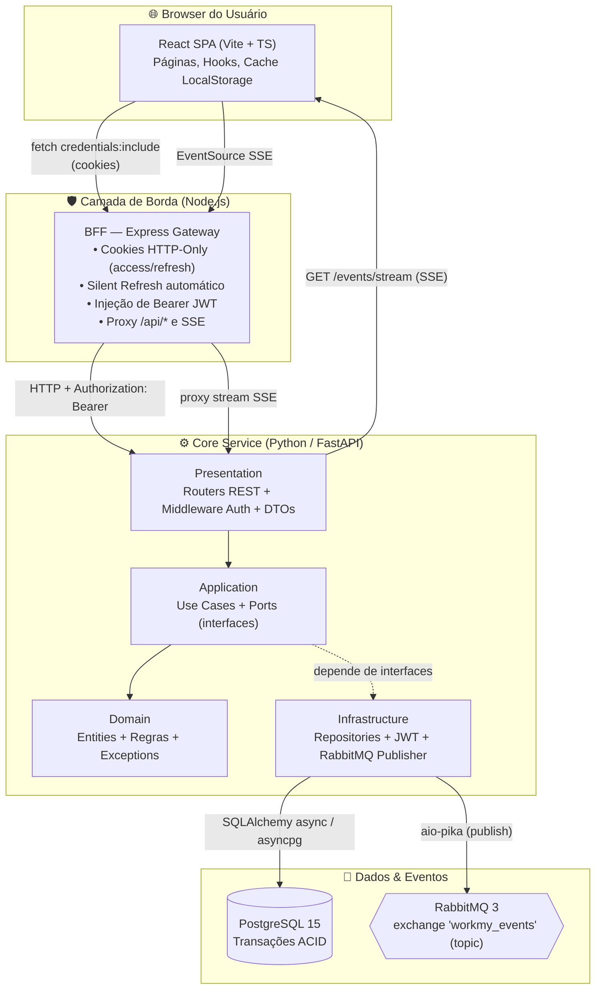
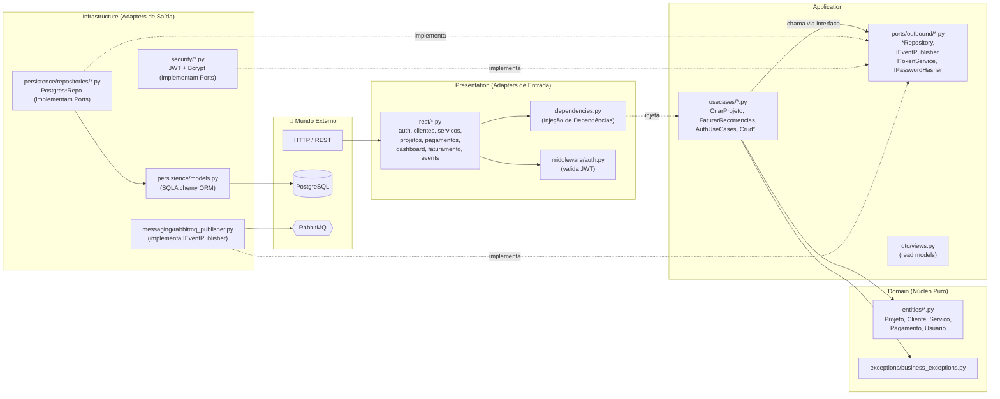
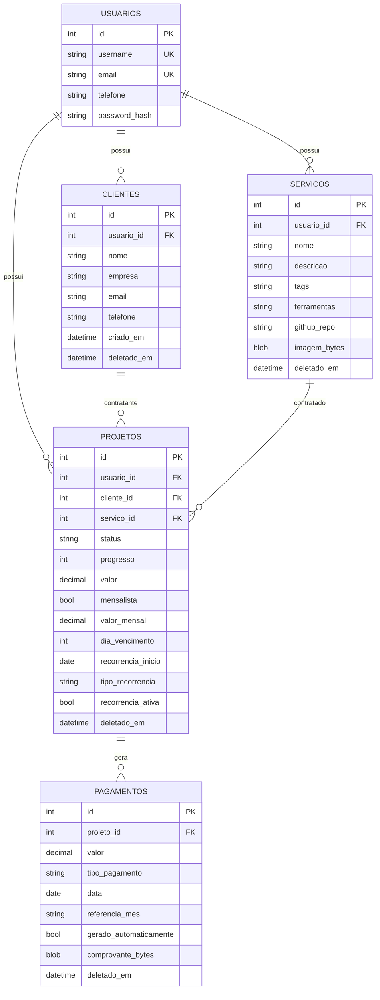
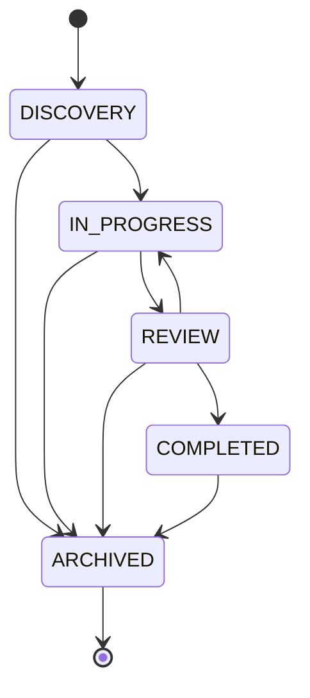
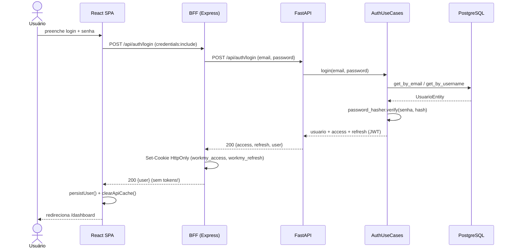
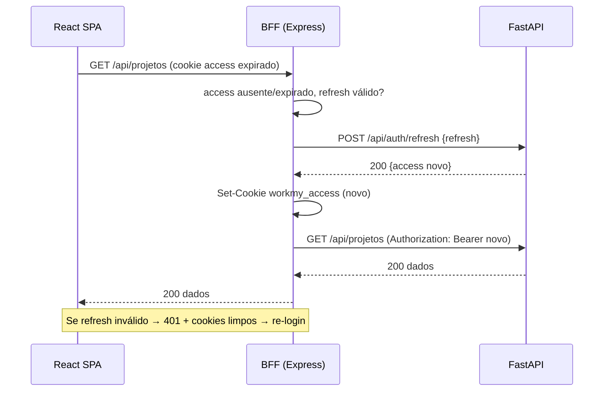
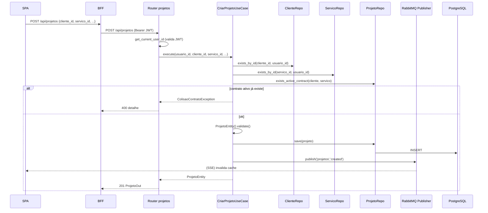
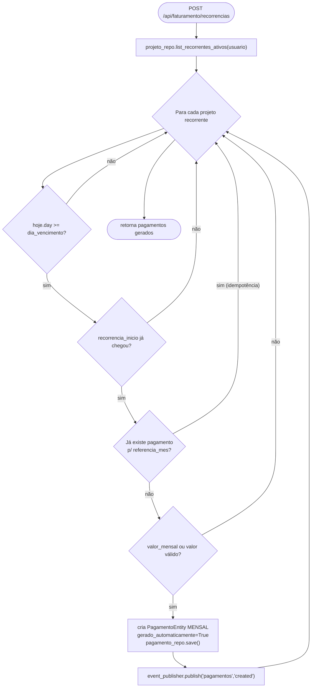
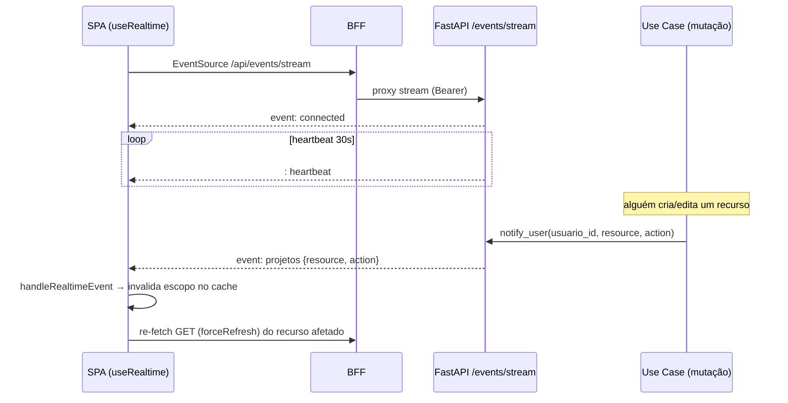
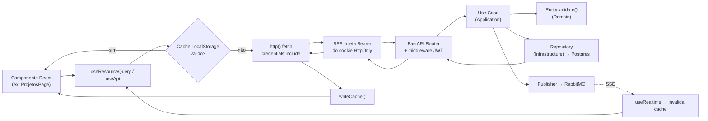

# 🏛️ WorkMy — Arquitetura Consolidada

> Documento único que reúne a **arquitetura geral**, os **diagramas de use cases** e o mapa de **como tudo se conecta** na plataforma WorkMy.
> Os diagramas estão em **Mermaid.js** e renderizam direto no GitHub, VS Code (extensão Mermaid) ou qualquer visualizador Markdown compatível.
>
> Companheiro deste documento: **[`BOOK_CONCEITOS.md`](./BOOK_CONCEITOS.md)** — explica cada conceito do código e como usá-lo.

---

## 1. O que é o WorkMy

WorkMy é uma plataforma **fullstack** para gestão de atividades freelance: clientes, serviços, projetos/contratos, controle financeiro de faturamento real acumulado e geração de cobranças recorrentes idempotentes, **isolada por usuário (multitenant lógico)**.

O sistema é um **monorepo desacoplado** composto por quatro processos independentes que se comunicam por rede:

| Processo | Tecnologia | Papel | Porta padrão |
|----------|-----------|-------|--------------|
| **SPA** | React 19 + Vite + TypeScript | Interface do usuário (browser) | 5173 |
| **BFF** | Node.js + Express | Gateway de segurança: cookies HTTP-Only, silent refresh, proxy | 3000 |
| **Core API** | Python + FastAPI + SQLAlchemy async | Regras de negócio (Arquitetura Hexagonal) | 8000 |
| **Persistência / Mensageria** | PostgreSQL 15 + RabbitMQ 3 | Dados ACID + eventos assíncronos | 5432 / 5672 |

---

## 2. Arquitetura Principal (visão multicamadas)

Cada caixa é um processo separado. A regra de ouro: **o browser nunca fala direto com o FastAPI nem vê o JWT** — tudo passa pelo BFF, que guarda os tokens em cookies HTTP-Only.

### Por que essa separação?

- **SPA isolada:** rápida, renderiza no browser, mantém cache local para reduzir latência.
- **BFF como guardião do token:** o JWT vive em cookie `HttpOnly` + `Secure` + `SameSite`, inacessível a JavaScript — mitiga XSS/roubo de token. O BFF também faz o *silent refresh* quando o access token expira.
- **Core API stateless:** valida o `Bearer` em cada request, aplica regras de negócio e devolve JSON. Não guarda sessão.
- **Postgres + RabbitMQ:** dados consistentes (ACID) e eventos assíncronos para invalidação de cache em tempo real (SSE).

---

## 3. Arquitetura Hexagonal do Core (Clean Architecture)

O backend FastAPI segue **Ports & Adapters**. A direção das dependências aponta sempre para dentro: a camada de fora conhece a de dentro, **nunca o contrário**. O `Domain` não importa nada de framework.

**Leitura do diagrama:** o `Use Case` depende apenas de **interfaces** (`Ports`). Quem decide qual implementação concreta entra é o `dependencies.py` (composição). Trocar Postgres por outro banco, ou RabbitMQ por Kafka, não toca no domínio nem nos use cases.

---

## 4. Modelo de Dados (ER)

Todas as entidades de negócio pertencem a um `usuario` (isolamento multitenant). Deleções são **soft delete** (`deletado_em`).

> 🔑 **Regra de integridade chave:** `PAGAMENTOS` tem `UniqueConstraint(projeto_id, referencia_mes)`. É isso que torna a recorrência mensal **idempotente** — impossível faturar duas vezes o mesmo mês de um projeto.

### Máquina de estados do Projeto

O `status` de um projeto só transita por caminhos permitidos (`STATUS_TRANSITIONS` em `domain/entities/projeto.py`):

---

## 5. Diagramas de Use Cases

### 5.1 Autenticação — Login com cookies HTTP-Only

### 5.2 Silent Refresh — renovação transparente do token

Quando o access token (15 min) expira mas o refresh (7 dias) ainda vale, o BFF renova **sem o usuário perceber**.

### 5.3 Criar Projeto — regras de negócio + evento assíncrono

### 5.4 Faturamento Recorrente Idempotente

Executado sob demanda; gera **uma única** mensalidade por mês por projeto.

### 5.5 Tempo Real (SSE) + Invalidação de Cache

---

## 6. Como tudo se conecta (resumo do fluxo de uma requisição)

### Mapa de tecnologias por responsabilidade

| Responsabilidade | Tecnologia | Onde no código |
|---|---|---|
| UI / Roteamento SPA | React 19, React Router 7, Vite | `frontend/src/App.tsx`, `pages/`, `components/` |
| Cache cliente + tempo real | LocalStorage + EventSource (SSE) | `frontend/src/shared/lib/cache.ts`, `hooks/useRealtime.ts` |
| Segurança de sessão | Cookies HTTP-Only + silent refresh | `frontend/bff/server.js` |
| API REST async | FastAPI + Pydantic | `backend-fastapi/src/presentation/` |
| Regras de negócio | Use Cases + Domain Entities | `backend-fastapi/src/application/`, `domain/` |
| Persistência | SQLAlchemy 2 async + asyncpg | `backend-fastapi/src/infrastructure/persistence/` |
| Autenticação | JWT (python-jose) + bcrypt | `backend-fastapi/src/infrastructure/security/` |
| Mensageria | RabbitMQ + aio-pika | `backend-fastapi/src/infrastructure/messaging/` |
| Orquestração local | Docker Compose | `docker-compose.yml` |

---

## 7. Decisões arquiteturais de destaque

1. **BFF guarda o token, não o browser** — o JWT nunca chega ao JavaScript do SPA; vive em cookie `HttpOnly`. Mitiga XSS.
2. **Stateless no core** — o FastAPI não tem sessão; cada request carrega o `Bearer`. Escala horizontalmente.
3. **Idempotência por constraint** — `UniqueConstraint(projeto_id, referencia_mes)` impede cobrança duplicada no nível do banco.
4. **Soft delete em tudo** — `deletado_em` preserva histórico e permite recontratação após exclusão lógica.
5. **Publisher resiliente** — RabbitMQ offline não derruba a API; o evento é descartado com `warning` (`rabbitmq_publisher.py`).
6. **Cache write-through com invalidação por SSE** — leitura instantânea + consistência quase em tempo real.
7. **Dashboard O(1)** — agregações feitas via `func.sum`/`group_by` no Postgres, não em loop Python (`postgres_dashboard_query.py`).

---

*Detalhamento conceitual de cada item acima → veja **[`BOOK_CONCEITOS.md`](./BOOK_CONCEITOS.md)**.*
