# 📖 WorkMy — Book de Conceitos do Código

> Guia conceitual do código-fonte do WorkMy. Cada capítulo explica **o que é o conceito**, **por que existe aqui**, **onde está no código** e **como usá-lo / estendê-lo**.
> Diagramas e visão macro: **[`ARQUITETURA_CONSOLIDADA.md`](./ARQUITETURA_CONSOLIDADA.md)**.

## Sumário

1. [Arquitetura Hexagonal (Ports & Adapters)](#1-arquitetura-hexagonal-ports--adapters)
2. [Domain — Entidades e regras puras](#2-domain--entidades-e-regras-puras)
3. [Exceptions de negócio](#3-exceptions-de-negócio)
4. [Application — Use Cases](#4-application--use-cases)
5. [Ports — as interfaces de saída](#5-ports--as-interfaces-de-saída)
6. [Injeção de Dependências (composição)](#6-injeção-de-dependências-composição)
7. [Infrastructure — Repositories e ORM](#7-infrastructure--repositories-e-orm)
8. [Segurança — JWT, bcrypt e blacklist](#8-segurança--jwt-bcrypt-e-blacklist)
9. [Presentation — Routers e DTOs](#9-presentation--routers-e-dtos)
10. [O padrão BFF (Backend For Frontend)](#10-o-padrão-bff-backend-for-frontend)
11. [Mensageria — RabbitMQ Publisher](#11-mensageria--rabbitmq-publisher)
12. [Tempo real — SSE](#12-tempo-real--sse)
13. [Frontend — cache, hooks e estado](#13-frontend--cache-hooks-e-estado)
14. [Recorrência idempotente](#14-recorrência-idempotente)
15. [Como adicionar uma nova feature de ponta a ponta](#15-como-adicionar-uma-nova-feature-de-ponta-a-ponta)

---

## 1. Arquitetura Hexagonal (Ports & Adapters)

**Conceito.** Também chamada *Clean Architecture*. O software é organizado em camadas concêntricas onde **as dependências apontam só para dentro**. O núcleo (Domain) não conhece banco, HTTP ou frameworks. A camada de Aplicação define **interfaces (Ports)**; o mundo externo fornece **implementações (Adapters)**.

**No WorkMy** (`backend-fastapi/src/`):

```
domain/          ← núcleo puro (regras), não importa nada externo
application/      ← use cases + ports (interfaces)
infrastructure/   ← adapters de saída (Postgres, JWT, RabbitMQ)
presentation/     ← adapters de entrada (HTTP/FastAPI) + DI
```

**Por que.** Você troca o banco, o broker ou o framework web sem reescrever a lógica de negócio. Também torna o domínio testável sem subir Postgres (basta um *fake* que implemente o Port).

**Como usar.** Sempre que um use case precisar de "algo de fora" (salvar, enviar email, publicar evento), ele recebe uma **interface** no construtor — nunca instancia a classe concreta. Veja isso em ação nos capítulos 4, 5 e 6.

---

## 2. Domain — Entidades e regras puras

**Conceito.** Uma *Entity* representa um conceito de negócio com identidade e regras de consistência. Aqui são `@dataclass` puros, sem herança de ORM, sem dependência de framework.

**Onde.** `domain/entities/` — `usuario.py`, `cliente.py`, `servico.py`, `projeto.py`, `pagamento.py`.

**Exemplo — validação intrínseca** (`domain/entities/projeto.py`):

```python
@dataclass
class ProjetoEntity:
    usuario_id: int
    cliente_id: int
    servico_id: int
    status: str = 'DISCOVERY'
    progresso: int = 0
    valor: Decimal | None = None
    ...

    def validate(self) -> None:
        if self.valor is not None and self.valor <= 0:
            raise ValidaEntidadeException("O valor do contrato deve ser maior que zero.")
        if not (0 <= self.progresso <= 100):
            raise ValidaEntidadeException("O progresso deve estar entre 0 e 100.")
        if not (1 <= self.dia_vencimento <= 28):
            raise ValidaEntidadeException("O dia de vencimento deve estar entre 1 e 28.")
        if self.status not in VALID_STATUSES:
            raise ValidaEntidadeException(f"Status inválido: {self.status}")
```

**Regra de máquina de estados** — o projeto não pula etapas:

```python
STATUS_TRANSITIONS = {
    "DISCOVERY":   {"IN_PROGRESS", "ARCHIVED"},
    "IN_PROGRESS": {"REVIEW", "ARCHIVED"},
    "REVIEW":      {"IN_PROGRESS", "COMPLETED", "ARCHIVED"},
    "COMPLETED":   {"ARCHIVED"},
    "ARCHIVED":    set(),
}

def validate_transition(self, new_status: str) -> None:
    if new_status not in STATUS_TRANSITIONS.get(self.status, set()):
        raise ValidaEntidadeException(f"Transição inválida: {self.status} -> {new_status}")
```

**Soft delete** — toda entidade expõe a mesma semântica:

```python
@property
def is_deleted(self) -> bool:
    return self.deletado_em is not None
```

**Como usar.** Coloque aqui qualquer regra que valha **sempre**, independente de caso de uso (formato de email, valor positivo, transições válidas). Use cases chamam `entity.validate()` antes de persistir.

---

## 3. Exceptions de negócio

**Conceito.** Erros de regra de negócio são um tipo distinto de erro de programação. Eles têm uma hierarquia própria e são traduzidos em respostas HTTP de forma centralizada.

**Onde.** `domain/exceptions/business_exceptions.py`:

```python
class BusinessException(Exception): ...
class ColisaoContratoException(BusinessException): ...   # recontratação de serviço ativo
class ValidaEntidadeException(BusinessException): ...     # validação síncrona falhou
class RecorrenciaInvalidaException(BusinessException): ...
class NaoEncontradoException(BusinessException): ...      # 404 / acesso negado
class ConflitoDeletarException(BusinessException): ...    # deleção com dependências
```

**Tradução para HTTP** — feita uma vez só, no `presentation/main.py`:

```python
@app.exception_handler(BusinessException)
async def business_exception_handler(request, exc):
    return JSONResponse(status_code=400, content={"detail": str(exc)})
```

**Como usar.** Levante a exceção semântica no use case (`raise NaoEncontradoException(...)`). Não monte `HTTPException` no domínio — deixe o handler global converter. (Alguns routers convertem manualmente para escolher o status, ex. 401 no login — veja cap. 9.)

---

## 4. Application — Use Cases

**Conceito.** Um *Use Case* orquestra um fluxo de negócio completo: valida posse, aplica regras, persiste, dispara efeitos. É a "história" da aplicação. Cada arquivo = uma intenção do usuário.

**Onde.** `application/usecases/` — `auth_usecases.py`, `criar_projeto.py`, `atualizar_projeto.py`, `deletar_projeto.py`, `crud_cliente.py`, `crud_servico.py`, `crud_pagamento.py`, `faturar_recorrencias.py`.

**Anatomia** (`application/usecases/criar_projeto.py`):

```python
class CriarProjetoUseCase:
    def __init__(self, projeto_repo, cliente_repo, servico_repo, event_publisher):
        # recebe só INTERFACES (Ports) — não sabe que é Postgres/RabbitMQ
        self.projeto_repo = projeto_repo
        ...

    async def execute(self, usuario_id, cliente_id, servico_id, ...):
        # 1. posse: cliente e serviço pertencem ao usuário?
        if not await self.cliente_repo.exists_by_id(cliente_id, usuario_id):
            raise ValidaEntidadeException("Cliente não encontrado ou não pertence a você.")
        if not await self.servico_repo.exists_by_id(servico_id, usuario_id):
            raise ValidaEntidadeException("Serviço não encontrado ou não pertence a você.")
        # 2. regra: não recontratar serviço ativo
        if await self.projeto_repo.exists_active_contract(cliente_id, servico_id):
            raise ColisaoContratoException("Cliente já possui este serviço contratado ativo.")
        # 3. monta + valida entidade
        projeto = ProjetoEntity(usuario_id=usuario_id, ...)
        projeto.sync_recorrencia()
        projeto.validate()
        # 4. persiste
        projeto_salvo = await self.projeto_repo.save(projeto)
        # 5. efeito colateral assíncrono
        await self.event_publisher.publish(usuario_id, 'projetos', 'created',
                                           meta={'projeto_id': projeto_salvo.id})
        return projeto_salvo
```

**Padrão recorrente em todos os use cases:**
1. recuperar / verificar posse via `usuario_id` (segurança multitenant),
2. checar regras que dependem de outras entidades,
3. montar entidade e chamar `validate()`,
4. persistir via repositório,
5. (quando aplicável) publicar evento.

**Como usar.** Crie uma classe `XUseCase` com `__init__` recebendo Ports e um `async def execute(...)`. Não importe SQLAlchemy nem FastAPI aqui.

---

## 5. Ports — as interfaces de saída

**Conceito.** *Port* é o contrato que o use case espera do mundo externo. É uma classe abstrata (`ABC`) com métodos `@abstractmethod`. Inversão de dependência (o "D" de SOLID).

**Onde.** `application/ports/outbound/`:

- `i_usuario_repository.py`, `i_cliente_repository.py`, `i_servico_repository.py`, `i_projeto_repository.py`, `i_pagamento_repository.py`
- `i_event_publisher.py`, `i_token_service.py`, `i_password_hasher.py`
- `i_dashboard_query.py`, `i_cliente_query.py` (read models / CQRS leve)

**Exemplo** (`application/ports/outbound/i_event_publisher.py`):

```python
class IEventPublisher(ABC):
    @abstractmethod
    async def publish(self, usuario_id: int, routing_key: str,
                      action: str, meta: dict | None = None) -> None: ...
```

**Repository vs Query.** Repositórios lidam com **entidades** (escrita/leitura de agregados). As *Queries* (`IDashboardQuery`, `IClienteQuery`) retornam **dicionários otimizados** para leitura/relatório — uma separação leve no estilo CQRS, evitando carregar entidades inteiras só para somar valores.

**Como usar.** Antes de escrever um adapter concreto, defina o Port. O use case importa o Port; a infraestrutura o implementa.

---

## 6. Injeção de Dependências (composição)

**Conceito.** O ponto onde as interfaces são "ligadas" às implementações concretas. No FastAPI isso é feito com `Depends`.

**Onde.** `presentation/dependencies.py`. Cada função monta um use case já com seus adapters:

```python
def get_criar_projeto_usecase(session: AsyncSession = Depends(get_db_session)) -> CriarProjetoUseCase:
    return CriarProjetoUseCase(
        projeto_repo=PostgresProjetoRepository(session),
        cliente_repo=PostgresClienteRepository(session),
        servico_repo=PostgresServicoRepository(session),
        event_publisher=rabbitmq_publisher,   # singleton global
    )
```

O router só declara `Depends(get_criar_projeto_usecase)` e recebe o use case pronto. A sessão de banco vem de `get_db_session` (cap. 7), que cuida de commit/rollback.

**Como usar.** Ao criar um novo use case, adicione uma função `get_x_usecase` aqui e injete-a no router com `Depends`.

---

## 7. Infrastructure — Repositories e ORM

**Conceito.** *Adapters de saída* que implementam os Ports usando tecnologia concreta. Aqui: SQLAlchemy 2 assíncrono + asyncpg (Postgres) ou aiosqlite (dev).

**Onde.** `infrastructure/persistence/`:
- `models.py` — modelos ORM (`UsuarioModel`, `ClienteModel`, `ServicoModel`, `ProjetoModel`, `PagamentoModel`),
- `session.py` — engine, fábrica de sessões, `get_db_session`,
- `repositories/` — `Postgres*Repo` (escrita) e `Postgres*Query` (leitura).

**Entity ≠ Model.** Importante: a **Entity** (domínio, dataclass pura) é diferente do **Model** (tabela SQLAlchemy). O repositório traduz entre os dois. Isso mantém o domínio livre do ORM.

**Sessão com transação automática** (`infrastructure/persistence/session.py`):

```python
async def get_db_session():
    async with async_session_maker() as session:
        try:
            yield session
            await session.commit()      # commit no fim do request
        except Exception:
            await session.rollback()    # rollback em erro
            raise
        finally:
            await session.close()
```

**Constraint de idempotência** (`infrastructure/persistence/models.py`):

```python
class PagamentoModel(Base):
    __table_args__ = (
        UniqueConstraint("projeto_id", "referencia_mes",
                         name="uniq_pagamento_projeto_referencia_mes"),
    )
```

**Leitura otimizada — Dashboard O(1)** (`repositories/postgres_dashboard_query.py`): agregações somadas pelo banco, não em Python:

```python
stmt = (
    select(ClienteModel.id, ClienteModel.nome,
           func.sum(PagamentoModel.valor).label("total"),
           func.count(PagamentoModel.id).label("quantidade"))
    .join(ProjetoModel, ...).join(ClienteModel, ...)
    .where(ProjetoModel.usuario_id == usuario_id,
           PagamentoModel.deletado_em.is_(None), ...)
    .group_by(ClienteModel.id, ClienteModel.nome)
)
```

**Como usar.** Para um novo agregado: crie o `Model`, defina o `Port`, implemente o `Postgres*Repo` traduzindo Model↔Entity. Sempre filtre por `usuario_id` e `deletado_em IS NULL`.

---

## 8. Segurança — JWT, bcrypt e blacklist

**Conceito.** Autenticação stateless por token assinado (JWT). Senha nunca em texto — hash bcrypt com salt. Logout revoga o token por `jti`.

**Onde.** `infrastructure/security/jwt_service.py` (funções) + `adapters.py` (implementam os Ports `ITokenService`/`IPasswordHasher`) + `presentation/middleware/auth.py` (valida no request).

**Dois tipos de token** (`jwt_service.py`):

```python
ACCESS_TOKEN_EXPIRE_MINUTES = 15   # curto — renovado via silent refresh
REFRESH_TOKEN_EXPIRE_DAYS  = 7     # durável

def create_access_token(usuario_id, username, email):
    to_encode = {"sub": str(usuario_id), "username": username, "email": email,
                 "exp": expire, "jti": secrets.token_hex(16), "type": "access"}
    return jwt.encode(to_encode, SECRET_KEY, algorithm="HS256")
```

O `jti` (JWT ID único) é o que permite revogar um token específico no logout.

**Hash de senha:**

```python
def hash_password(password):
    return bcrypt.hashpw(password.encode(), bcrypt.gensalt()).decode()
def verify_password(password, hashed):
    return bcrypt.checkpw(password.encode(), hashed.encode())
```

**Middleware que protege rotas** (`presentation/middleware/auth.py`):

```python
async def get_current_user_id(credentials = Depends(security)) -> int:
    payload = decode_token(credentials.credentials)
    if payload is None: raise HTTPException(401, "Token inválido ou expirado.")
    if payload.get("type") != "access": raise HTTPException(401, "Tipo de token inválido.")
    jti = payload.get("jti")
    if jti and is_token_revoked(jti): raise HTTPException(401, "Token revogado.")
    return int(payload["sub"])
```

A blacklist é um `set` em memória (`_token_blacklist`). **Nota de produção:** em multi-instância, troque por Redis compartilhado (o próprio código comenta isso).

**Como usar.** Qualquer rota protegida declara `usuario_id: int = Depends(get_current_user_id)`. O `usuario_id` extraído é a fonte de verdade para o filtro multitenant nos use cases.

---

## 9. Presentation — Routers e DTOs

**Conceito.** *Adapters de entrada*: traduzem HTTP ↔ use cases. Validação de entrada/saída com schemas Pydantic.

**Onde.** `presentation/rest/*.py` (um router por recurso) + `presentation/dto/schemas.py` (schemas Pydantic) + `presentation/main.py` (monta o app, CORS, handlers, lifespan).

**Montagem do app** (`presentation/main.py`):

```python
app = FastAPI(title="WorkMy Decoupled API", version="2.0.0", lifespan=lifespan)
app.add_middleware(CORSMiddleware, allow_origins=ALLOWED_ORIGINS, allow_credentials=True, ...)
app.include_router(auth_router, prefix="/api")
app.include_router(projetos_router, prefix="/api")
# ... clientes, servicos, pagamentos, dashboard, faturamento, events
```

**Lifespan** cria tabelas e abre a conexão persistente do RabbitMQ no startup, e fecha tudo no shutdown:

```python
@asynccontextmanager
async def lifespan(app):
    async with engine.begin() as conn:
        await conn.run_sync(Base.metadata.create_all)
    await rabbitmq_publisher.startup()
    yield
    await rabbitmq_publisher.shutdown()
    await engine.dispose()
```

**Router exemplo** (`presentation/rest/auth.py`) — note que o login escolhe **401** explicitamente:

```python
@router.post("/login", response_model=AuthResponseSchema)
async def login(payload: UserLoginSchema, auth_usecases = Depends(get_auth_usecases)):
    try:
        usuario, access, refresh = await auth_usecases.login(payload.email, payload.password)
        return {"access": access, "refresh": refresh, "user": {...}}
    except (NaoEncontradoException, ValidaEntidadeException) as e:
        raise HTTPException(status_code=401, detail=str(e))
```

**Como usar.** Novo recurso → novo `rest/<recurso>.py` com `APIRouter(prefix="/<recurso>")`, schemas em `dto/schemas.py`, e `include_router(...)` no `main.py`.

---

## 10. O padrão BFF (Backend For Frontend)

**Conceito.** Um servidor leve entre o SPA e a API, dedicado às necessidades do frontend — aqui, **segurança de sessão**. Ele transforma tokens JWT (que o JS não deve ver) em **cookies HTTP-Only**.

**Onde.** `frontend/bff/server.js` (Node.js + Express).

**Três responsabilidades:**

**(a) Login/Register/Logout interceptados** — recebe credenciais, chama o FastAPI, e grava cookies; devolve ao SPA **só dados públicos**:

```javascript
if (status === 200) {
    const { access, refresh, user } = body;
    setSessionCookies(res, access, refresh);   // Set-Cookie HttpOnly
    return res.status(200).json({ user });     // tokens NÃO voltam ao browser
}
```

Opções de cookie sensíveis ao ambiente:

```javascript
const COOKIE_OPTS_ACCESS = {
    httpOnly: true,
    secure: IS_PRODUCTION,                       // HTTPS em prod
    sameSite: IS_PRODUCTION ? 'strict' : 'lax',
    maxAge: 60 * 60 * 1000, path: '/'
};
```

**(b) Silent Refresh** — middleware que renova o access expirado usando o refresh, transparente para o usuário:

```javascript
if (!accessToken && refreshToken) {
    const { status, body } = await callFastApi('/api/auth/refresh', 'POST', { refresh: refreshToken });
    if (status === 200) {
        res.cookie('workmy_access', body.access, COOKIE_OPTS_ACCESS);
        req.headers['authorization'] = `Bearer ${body.access}`;
        return next();
    }
    clearSessionCookies(res);
    return res.status(401).json({ detail: 'Sessão expirada.' });
}
```

**(c) Proxy** — para as demais rotas `/api/*`, injeta `Authorization: Bearer <cookie>` e encaminha ao FastAPI. O SSE tem proxy próprio (`createProxyMiddleware`) para manter o stream aberto.

**Como usar.** O SPA sempre chama o BFF (`/api/...`) com `credentials: 'include'`; nunca o FastAPI diretamente. Para adicionar lógica de borda (rate limit, logging), é aqui.

---

## 11. Mensageria — RabbitMQ Publisher

**Conceito.** Eventos assíncronos desacoplam quem **causa** de quem **reage**. O publisher emite eventos numa *topic exchange*; consumidores (ex.: auditoria, fan-out de cache) reagem sem travar a requisição HTTP.

**Onde.** `infrastructure/messaging/rabbitmq_publisher.py` — implementa `IEventPublisher` como **singleton com conexão persistente**.

**Por que singleton.** Abrir uma conexão TCP/AMQP por evento custava ~50–200 ms e esgotava sockets. A conexão agora é aberta uma vez no `startup()` e reusada:

```python
async def startup(self):
    self._connection = await aio_pika.connect_robust(self._amqp_url, reconnect_interval=5)
    self._channel = await self._connection.channel()
    self._exchange = await self._channel.declare_exchange("workmy_events",
                                                          ExchangeType.TOPIC, durable=True)
```

**Resiliência.** Se o RabbitMQ estiver offline, a API **não cai** — o evento é descartado com `warning`:

```python
async def publish(self, usuario_id, routing_key, action, meta=None):
    if self._exchange is None:
        logger.warning(f"RabbitMQ offline. Evento '{routing_key}.{action}' descartado.")
        return
    payload = {"usuario_id": usuario_id, "action": action,
               "routing_key": routing_key, "meta": meta or {}}
    await self._exchange.publish(aio_pika.Message(body=json.dumps(payload).encode(),
                                 delivery_mode=PERSISTENT), routing_key=routing_key)
```

**Como usar.** Use cases recebem `IEventPublisher` e chamam `publish('<recurso>', '<action>')` após uma mutação relevante. O singleton global é injetado no `dependencies.py`.

---

## 12. Tempo real — SSE

**Conceito.** *Server-Sent Events*: canal HTTP unidirecional servidor→cliente. Usado para avisar o SPA que um recurso mudou, disparando invalidação de cache.

**Onde.** Backend: `presentation/rest/events.py`. Frontend: `hooks/useRealtime.ts`.

**Registro de conexões por usuário** (`events.py`):

```python
_connections: dict[int, set[asyncio.Queue]] = {}

def notify_user(usuario_id, resource, action, meta=None):
    payload = json.dumps({"resource": resource, "action": action,
                          "scopes": [f"/{resource}/"], "meta": meta or {}, ...})
    for queue in _connections.get(usuario_id, set()).copy():
        queue.put_nowait(payload)
```

O gerador mantém a conexão viva com **heartbeat a cada 30 s** e fecha ao desconectar. A rota é protegida por `Depends(get_current_user_id)`.

> **Nota arquitetural (do próprio código):** hoje o SSE não consome do RabbitMQ — serve como canal de invalidação direto. A evolução natural é um consumidor RabbitMQ por usuário conectado (fan-out).

**Cliente** (`hooks/useRealtime.ts`):

```javascript
const source = new EventSource(`${API_BASE_URL}/events/stream`, { withCredentials: true })
for (const type of ['pagamentos','projetos','clientes','servicos','dashboard'])
    source.addEventListener(type, onMessage)
// onMessage → handleRealtimeEvent(scope, payload) → invalida cache do escopo
```

**Como usar.** Para reagir a um novo recurso em tempo real, adicione o tipo no array do `useRealtime` e garanta que o backend chame `notify_user(...)` na mutação.

---

## 13. Frontend — cache, hooks e estado

**Conceito.** O SPA usa um **cache write-through em LocalStorage** com invalidação proativa, isolado por usuário, para leitura instantânea sem sacrificar consistência.

**Onde.** `shared/lib/cache.ts`, `hooks/useApi.ts`, `hooks/useResourceQuery.ts`, `state/AuthContext.tsx`, `lib/http.ts`, `config.ts`.

**Cliente HTTP sem token** (`lib/http.ts`) — os cookies fazem o trabalho:

```typescript
const res = await fetch(url, {
  method, headers, body,
  credentials: 'include',   // browser envia cookies HttpOnly automaticamente
})
```

**Cache scoping multitenant** (`useApi.ts` + `cache.ts`):

```typescript
const cacheScope = userCacheScope(user?.id)        // "user:<id>"
const cacheKey = buildCacheKey(cacheScope, path, options?.query)
if (method === 'GET' && !options?.forceRefresh) {
  const cached = readCache<T>(cacheKey)
  if (cached !== null) return cached                // hit → instantâneo
}
// ... após resposta:
if (method === 'GET') writeCache(cacheKey, response, options?.cacheTtlMs)
else if (!options?.skipCacheInvalidation) invalidateMutationDefaults(cacheScope)
```

**Hook de consulta com re-fetch automático** (`useResourceQuery.ts`) — escuta o cache e recarrega quando o escopo é invalidado (por mutação local **ou** por SSE):

```typescript
useEffect(() => {
  const unsubscribe = subscribeCache((scopes) => {
    if (scopeMatches(scopes, watchScopes)) void load(true)   // força refresh
  })
  return unsubscribe
}, [enabled, load, watchScopes])
```

**Estado de auth sem segredos** (`state/AuthContext.tsx`) — guarda só dados públicos:

```typescript
// C6: tokens NUNCA no frontend; BFF gerencia via HttpOnly cookies.
const login = async (username, password) => {
  const payload = await http<BffAuthResponse>('/auth/login', { method:'POST', body:{username,password} })
  persistUser(payload.user)   // só {id, username, email}
}
```

Em qualquer 401 do BFF (`useApi.ts`), o frontend força `logout()` local — sessão expirada e refresh falhou.

**Como usar.** Em uma página, chame `useResourceQuery<T>('/recurso', { watchScopes: '/recurso/' })`. Leituras vêm do cache; mutações via `useApi().request(..., {method:'POST'})` invalidam o escopo automaticamente.

---

## 14. Recorrência idempotente

**Conceito.** *Idempotência*: executar a operação N vezes tem o mesmo efeito de executá-la uma vez. Aqui garante que a mensalidade de um projeto seja faturada **uma única vez por mês**, mesmo se o gatilho rodar várias vezes.

**Onde.** `application/usecases/faturar_recorrencias.py` + constraint em `models.py` (cap. 7).

**Dupla proteção:**

1. **Lógica** — antes de criar, verifica se já existe pagamento para a referência:

```python
referencia_mes = hoje.strftime("%Y-%m")
for projeto in projetos:
    if hoje.day >= projeto.dia_vencimento:
        if projeto.recorrencia_inicio and hoje < projeto.recorrencia_inicio:
            continue
        if not await self.pagamento_repo.exists_by_referencia(projeto.id, referencia_mes):
            valor = projeto.valor_mensal or projeto.valor
            if not valor or valor <= 0:
                continue
            pagamento = PagamentoEntity(projeto_id=projeto.id, valor=valor, data=hoje,
                        tipo_pagamento='MENSAL', referencia_mes=referencia_mes,
                        gerado_automaticamente=True, ...)
            pagamento.validate()
            await self.pagamento_repo.save(pagamento)
            await self.event_publisher.publish(usuario_id, 'pagamentos', 'created', ...)
```

2. **Banco** — `UniqueConstraint(projeto_id, referencia_mes)` é a rede de segurança final: mesmo em corrida, o segundo INSERT falha.

**Faturamento manual** (`crud_pagamento.py`): lançamentos manuais MENSAL também checam duplicidade por referência; avulsos (`AVULSO`) não geram `referencia_mes`.

**Como usar.** Dispare `FaturarRecorrenciasUseCase.execute(usuario_id)` sob demanda (endpoint `/api/faturamento/recorrencias`) ou agendado. Rodar duas vezes no mesmo dia não duplica nada.

---

## 15. Como adicionar uma nova feature de ponta a ponta

Siga a direção das camadas, de dentro para fora:

```mermaid
flowchart LR
    A["1. Domain<br/>Entity + validate()"] --> B["2. Port<br/>I*Repository (ABC)"]
    B --> C["3. Use Case<br/>execute() usando o Port"]
    C --> D["4. Infra<br/>Postgres*Repo + Model"]
    D --> E["5. DI<br/>get_x_usecase em dependencies.py"]
    E --> F["6. Router<br/>rest/x.py + schema Pydantic"]
    F --> G["7. main.py<br/>include_router"]
    G --> H["8. Frontend<br/>config endpoint + useResourceQuery"]
    H --> I["9. Tempo real<br/>publish + notify_user + useRealtime"]
```



**Checklist:**
1. **Domain** — crie/edite a `Entity` com `validate()` e regras puras.
2. **Port** — declare a interface em `application/ports/outbound/`.
3. **Use Case** — orquestre o fluxo recebendo Ports no construtor.
4. **Infra** — implemente o `Postgres*Repo` e o `Model` (Entity↔Model), filtrando por `usuario_id`/`deletado_em`.
5. **DI** — registre o `get_x_usecase` em `dependencies.py`.
6. **Router** — exponha em `rest/x.py` com schemas Pydantic e `Depends(get_current_user_id)`.
7. **main.py** — `include_router(x_router, prefix="/api")`.
8. **Frontend** — adicione o endpoint em `config.ts` e consuma com `useResourceQuery`.
9. **Tempo real (opcional)** — `event_publisher.publish(...)` no use case e o tipo no `useRealtime`.

---

*Visão macro e diagramas → **[`ARQUITETURA_CONSOLIDADA.md`](./ARQUITETURA_CONSOLIDADA.md)**.*
